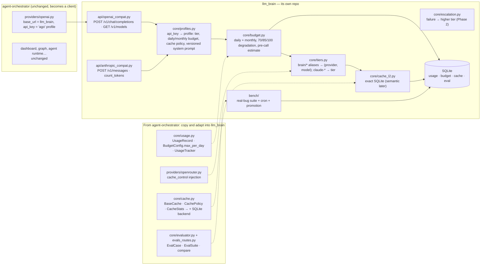

# agent-orchestrator: from backend to client, and what to reuse

Decision (2026-09-19): **llm_brain is a single, standalone backend**;
agent-orchestrator does not contain it, **it uses it**, like the apps.
Reason: centralize every LLM request in one place (budget, cache, usage),
independent of who makes it.

Repo: [pjcau/agent-orchestrator](https://github.com/pjcau/agent-orchestrator),
verified on the code (clone of 2026-09-19).

## How agent-orchestrator becomes a client

`providers/openai.py` with `base_url = llm_brain` and the `ago` profile's
`api_key`. Everything else (dashboard, graph, agent runtime) is unchanged.
Its `providers/openrouter.py` becomes redundant: only llm_brain sees
OpenRouter.

## What to copy into llm_brain (don't depend on it)

Standalone means standalone: the useful modules are copied and adapted,
the package is not imported. They are small.

| Module | Lines | What it gives | What's missing |
|--------|-------|---------------|----------------|
| `core/usage.py` | 287 | `UsageRecord`, `BudgetConfig.max_per_day`, `UsageTracker.check_budget` | per-profile, monthly, SQLite persistence, degradation |
| `core/cache.py` | 327 | `BaseCache`, `CachePolicy`, `CacheStats.hit_rate`, `InMemoryCache` | SQLite backend, key from the normalized request |
| `providers/openrouter.py` | — | `cache_control` injection for cacheable prefixes | reading `cached_tokens`, `session_id` |
| `core/evaluator.py` + `dashboard/evals_routes.py` | 584 + 267 | `EvalCase`/`EvalSuite`, `POST /api/evals/run`, `compare` | "run the tests" verifier, report persistence, cron |
| `core/router.py` | — | regex classifier | not needed in Phase 1 (routing by alias + escalation) |

## What exists nowhere (grep over all of `src/`: zero matches)

- `POST /v1/chat/completions`, `POST /v1/messages`: the two dialects. They
  are the heart of llm_brain and must be written.

{/* diagram: 05-agent-orchestrator-modules */}

