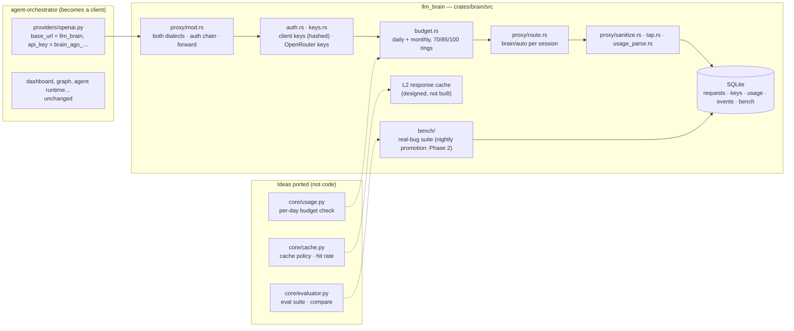

# agent-orchestrator: from backend to client, and what was reused

Decision (2026-09-19): **llm_brain is a single, standalone backend**;
agent-orchestrator does not contain it, **it uses it**, like the apps.
Reason: every LLM request in one place (budget, cache, usage), whoever
makes it.

Repo: [pjcau/agent-orchestrator](https://github.com/pjcau/agent-orchestrator),
read on the code (clone of 2026-09-19).

## How agent-orchestrator becomes a client (not wired yet)

`providers/openai.py` with `base_url` = llm_brain and a client key of the
`ago` profile (1 $/day, 5 $/month). Everything else (dashboard, graph,
agent runtime) is unchanged; its `providers/openrouter.py` becomes
redundant. Tracked on the [roadmap](../roadmap.md) (Phase 1.x) and in
[Apps](../architecture/apps.md).

## What was taken from it

llm_brain is [in Rust](./stack.md), so nothing is imported: the modules
were small, and what carried over is their data model and thresholds.

| agent-orchestrator | Became in llm_brain | Status |
|--------------------|---------------------|--------|
| `core/usage.py` — `UsageRecord`, `BudgetConfig.max_per_day`, `check_budget` | `budget.rs` (per-profile daily/monthly, degradation) + `proxy/usage_parse.rs`, SQLite `requests` | built |
| `providers/openrouter.py` — `cache_control` injection, usage parsing | `proxy/usage_parse.rs` reads `cached_tokens` and `usage.cost`; `cache_control` is left to the clients, which already send it | built (no injection) |
| `core/evaluator.py` + `evals_routes.py` — `EvalCase`/`EvalSuite`, `compare` | `bench/`: real-bug tasks verified by the repo's own tests, not an LLM judge | built; nightly cron + promotion not yet |
| `core/cache.py` — `BaseCache`, `CachePolicy`, `CacheStats` | the L2 response cache ([cache](../architecture/cache.md)) | **not built** (only the `l2_cache` profile field) |
| `core/router.py` — regex classifier | replaced by [`brain/auto`](../architecture/auto-routing.md) (decision model per session) | not ported |

The two dialects (`POST /v1/chat/completions`, `POST /v1/messages`)
existed nowhere in agent-orchestrator and were written from scratch
(`proxy/`).

{/* diagram: 05-agent-orchestrator-modules */}

