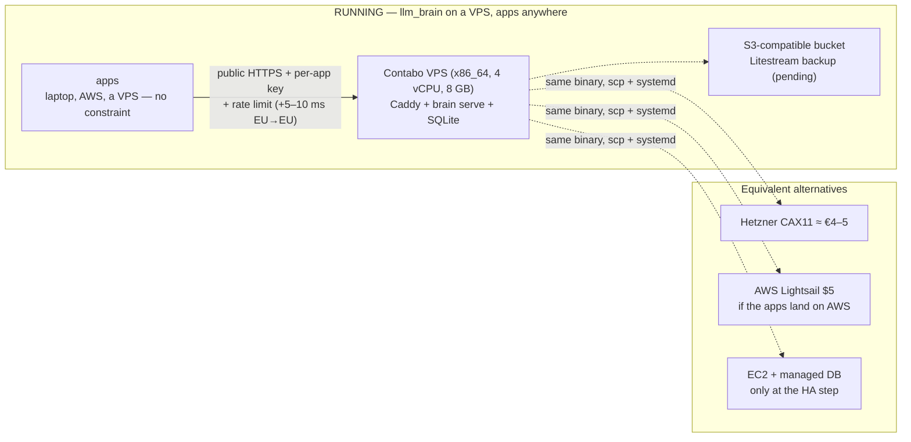

# Hosting: VPS, not AWS

:::note What runs today
**Contabo VPS** (x86_64, 4 vCPU, 8 GB, Ubuntu 24.04), Caddy + Let's
Encrypt on an sslip.io hostname, `brain` under systemd, deployed
2026-09-20 ([VPS deployment](../deploy-vps.md)). The 2026-09-19 decision
named Hetzner CAX11; the reasoning below is provider-neutral and holds for
any small VPS. Litestream backups are configured in `deploy/` but not
installed yet.
:::

## Decision (2026-09-19): a small VPS, apps anywhere

llm_brain is **one static Rust binary + one SQLite file + Caddy**, single
instance. It runs on a small VPS with a protected public HTTPS endpoint;
the apps have **no location constraint** (AWS, another VPS, home) and reach
it with per-app keys ([Authentication flow](../architecture/auth-flow.md)).

Why, in short:

- **Traffic is negligible** (below): bandwidth costs zero everywhere.
- **Performance is not a criterion**: model time (0.5–30 s) dominates. The
  hop EU → OpenRouter adds ~100–150 ms TTFB anywhere in the EU; an app on
  AWS Frankfurt calling an EU VPS adds +5–10 ms. Streaming pass-through
  adds < 5 ms; SQLite WAL < 1 ms per write.
- **Cost is a coin flip** with the Rust footprint (~20–40 MB RSS): every
  smallest tier fits (a VPS ~€4–5, Lightsail $5; EC2 is pricier because of
  the paid IPv4). Tokens, not hosting, are the dominant cost.
- **What tips it to a VPS**: free RAM headroom (in-process embeddings for a
  semantic cache would need > 0.5 GB), flat pricing with no metered egress
  (AWS: $0.09/GB after 1 TB), no burstable CPU throttling under the nightly
  benchmark, in-place rescale.
- **Discarded**: Lambda + DynamoDB (≈ $2–3/month, but no local SQLite:
  budget/keys/usage move to DynamoDB — an architecture change for ~€2 of
  savings); ECS Fargate (ALB alone ~$16/month).

AWS is the *graduation* path at the HA step, not the starting point: the
binary moves with `scp`; SQLite → managed Postgres is the real work,
wherever it happens.

{/* diagram: 11-hosting-options */}

## Traffic estimate

From the [budgets per profile](../architecture/budget.md), 2026-09-19:

| Profile | Requests/day | Tokens/day | Bytes/day (≈ 4 B/token) |
|---------|--------------|------------|-------------------------|
| `dev` (Claude Code + aider) | 300–600 | ~12 M input | ~50 MB |
| `assistant` | ~200 chats | ~1 M | ~4 MB |
| `car` (1 000 valuations/day) | ~1 000 | ~3 M | ~12 MB |
| `market` (later) | ~1 000 | ~3 M | ~12 MB |
| **Total** | **~3 000/day ≈ 0.03 req/s** | **~20 M/day** | **~80 MB/day ≈ 2.5 GB/month** |

Even at 10× the machine stays the same. The [board](../phase-1.md) now
records real per-request numbers; use them instead of this estimate.

## Hostname, not a domain

Caddy's automatic HTTPS (Let's Encrypt) needs a **name**, not a purchased
domain:

| Option | Cost | When |
|--------|------|------|
| **sslip.io** (`brain.1-2-3-4.sslip.io` resolves to the IP) — **in use** | 0 | now: a private API nobody has to remember |
| Subdomain of an owned domain | 0 | one A record, if a domain exists |
| New domain (Cloudflare Registrar / Porkbun) | ~€10/year | with the first public app; llm_brain becomes a subdomain |

Client keys don't depend on the hostname: renaming is a `base_url` change.

## When to reconsider

- An app sustains > ~1 req/s (30× the estimate): more dedicated vCPUs, not
  a change of cloud.
- High availability becomes a requirement: SQLite + one instance is no
  longer enough — an architecture change (managed Postgres, two
  instances), decided with usage data.
- SLA-backed uptime is required, or the apps all land on AWS and one
  provider is wanted: Lightsail $5 runs the same binary, Caddy and
  Litestream (to S3) with no penalty.
