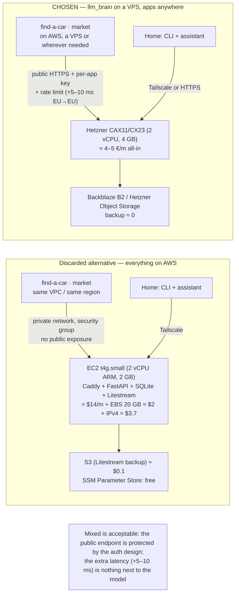

# Hosting: AWS or VPS? Costs by traffic, components and performance

Prices verified on 2026-09-19 (AWS Lightsail from the price list, EC2 from
the pricing API, Frankfurt region); Hetzner prices are indicative (page
rendered via JS) and must be confirmed on the site.

## Traffic first: how much really flows through llm_brain

Estimated from the [budgets per profile](../architecture/budget.md) and the
`fast` tier prices (~$0.075/M input):

| Profile | Requests/day | Tokens/day | Bytes/day (≈ 4 B/token) |
|---------|--------------|------------|-------------------------|
| `dev` (Claude Code + aider, ~1 €/day) | 300–600 | ~12 M input | ~50 MB |
| `assistant` (local) | ~200 chats | ~1 M | ~4 MB |
| `car` (1 000 valuations/day) | ~1 000 | ~3 M | ~12 MB |
| `market` (later) | ~1 000 | ~3 M | ~12 MB |
| **Total** | **~3 000/day ≈ 0.03 req/s** | **~20 M/day** | **~80 MB/day ≈ 2.5 GB/month** |

The conclusion that decides everything: **traffic is negligible**. 2.5
GB/month against allowances of 1 TB (Lightsail) or 20 TB (Hetzner):
bandwidth costs zero everywhere. llm_brain is an I/O-bound proxy: CPU
almost always idle, RAM ~20–40 MB as a Rust binary (+ Litestream), Caddy
another ~50 MB.

Even at **10×** (30 000 req/day) the machines below stay the same.

## Monthly cost per option

| Option | Compute | Mandatory extras | Backup | **Total/month** |
|--------|---------|------------------|--------|-----------------|
| **Hetzner CAX11** (2 vCPU ARM, 4 GB, 40 GB) | ~€3.8 | IPv4 ~€0.5 | Object Storage/B2 ≈ 0 | **~€4–5** |
| **AWS Lightsail 1 GB** (2 vCPU, 40 GB, 2 TB) | $7 (IPv4 included) | — | S3 ≈ $0.1 | **~$7** |
| **AWS Lightsail 2 GB** (2 vCPU, 60 GB, 3 TB) | $12 | — | S3 ≈ $0.1 | **~$12** |
| **AWS EC2 t4g.micro** (2 vCPU ARM, 1 GB) | $7.0 | EBS gp3 20 GB ~$2 + public IPv4 ~$3.7 | S3 | **~$13** |
| **AWS EC2 t4g.small** (2 vCPU ARM, 2 GB) | $14.0 | same | S3 | **~$20** |
| AWS ECS Fargate 0.25 vCPU/0.5 GB | ~$9 | **ALB ~$16+** | — | **~$25+**, and SQLite doesn't fit |
| AWS Lambda | — | — | — | **no**: long streams, SQLite, cold starts |

Notes:
- On EC2 the **public IPv4 is charged** ($0.005/h ≈ $3.7/month); on
  Lightsail it is included. With Tailscale/VPC it can be avoided entirely.
- Lightsail is "AWS's VPS": fixed price, IPv4 included, in the same region
  as the other AWS resources (VPC peering available). It is the simplest
  AWS option for this workload.
- SSM Parameter Store (standard) is free; Secrets Manager costs
  $0.40/secret/month: use SSM.
- **The dominant cost is not hosting**: it's tokens (≈ 40 €/month).
  Hosting is 10–30% of the total, whatever the option.

## Performance: what really changes and what doesn't

| Component | Impact | Depends on AWS vs VPS? |
|-----------|--------|------------------------|
| **Model time** (0.5–30 s) | dominates everything | no |
| Hop VPS → OpenRouter (Cloudflare edge, US upstream) | +100–150 ms TTFB per request from the EU | no (same anywhere in the EU) |
| Hop client → llm_brain | +10–30 ms in the EU; ~0 if app and llm_brain share a private network | **yes: put them together** |
| Streaming pass-through (axum/reqwest) | < 5 ms if not buffered | no |
| SQLite WAL, one write per request | < 1 ms; handles hundreds of req/s, we're at 0.03 | no |
| Concurrency (tokio, one process) | thousands of simultaneous streams on 1 vCPU | no |
| Burstable CPU (t4g/t3 credits) | I/O-bound: credits are not consumed | no |
| **In-process** semantic L2 cache (local embeddings) | +0.5–1 GB RAM | yes: 4 GB (Hetzner) or t4g.medium; or embeddings via OpenRouter and RAM unchanged |

On Claude Code the only latency you feel is the sum of +100–150 ms for
every agent request (dozens per task): the cost of being in the EU with a
US upstream, identical on AWS and VPS. Putting llm_brain in the US would
remove it but add the same delay towards the clients: irrelevant.

{/* diagram: 11-hosting-options */}

## Decision (2026-09-19): llm_brain on a VPS, apps anywhere

**llm_brain on Hetzner (CAX11/CX23, ~€4–5/month)**, with a protected
public HTTPS endpoint. The apps **have no location constraint**: find-a-car
and market can go to AWS, a VPS, or stay at home.

Why "mixed" is fine, contrary to the first draft of this page:

- **Performance**: model time dominates; a hop AWS Frankfurt → Hetzner
  Falkenstein costs +5–10 ms per request. Not measurable.
- **Public exposure**: that is exactly what per-app keys, per-key and
  per-`user` rate limits, IP blocking and TLS via Caddy are for
  ([Authentication flow](../architecture/auth-flow.md)). Tailscale stays
  for the admin and the home clients, not for the apps.
- **Hidden cost**: AWS egress to the internet $0.09/GB → at 2.5 GB/month
  ≈ $0.2. Nothing.
- The price actually paid is operational: two providers. Accepted.

If a private network were ever needed (e.g. to expose nothing), the "same
cloud" option remains valid and documented above: it's a change of
hosting, not of architecture.

## With everything in Rust: is the VPS still ahead of AWS?

Rust changes the footprint, not the traffic: ~20–40 MB of RAM and a CPU
that is idle at 0.03 req/s. That makes the **smallest tier viable
everywhere**, and the comparison shifts:

| Option | Fits a Rust binary? | Total/month | What you get |
|--------|---------------------|-------------|--------------|
| **Hetzner CAX11** (2 vCPU, 4 GB, 20 TB) | yes, 100× headroom | **~€4–5** | RAM and bandwidth you don't need, EU data location, no metered extras |
| **AWS Lightsail $5** (2 vCPU, 0.5 GB, 20 GB, 1 TB, IPv4 included) | yes, comfortably (binary + Caddy + Litestream ≈ 100 MB) | **~$5 ≈ €4.6** | same AWS account/region as the apps, SSM free |
| AWS EC2 **t4g.nano** (0.5 GB) | yes | $3.5 + EBS ~$1 + IPv4 $3.7 ≈ **$8** | the paid IPv4 makes it pricier than Lightsail |
| AWS **Lambda + Function URL** (Rust, response streaming) | yes: cold start ~20 ms, streaming up to 15 min | ≈ **$2–3** at 3 000 req/day × ~10 s × 128 MB | cheapest, **but** no local SQLite: budget/keys/usage move to DynamoDB, Litestream and the "one file to back up" story go away, local dev and `brain bench` get harder |

What Rust changed:
- **Cost**: Hetzner vs Lightsail is now a coin flip (€4–5 vs ≈ €4.6). With
  Python the 0.5 GB tiers were too tight; now they aren't.
- **Serverless became possible** (Lambda + DynamoDB), and it is the only
  option that is actually cheaper. It is also the only one that changes
  the architecture ([auth topology](../architecture/auth-topology.md):
  single instance, SQLite, Litestream). Not worth it at ≈ €2/month of
  savings.
- **Operations are identical everywhere**: one static binary, `scp` +
  systemd unit, Caddy in front. No runtime, no container needed.

What did not change:
- Performance: model time dominates; nothing here is measurable.
- Traffic: negligible on every plan.

**Verdict**: the decision stands — VPS — but it is no longer a cost
decision. The remaining reasons are headroom for free (semantic cache
embeddings in-process would need > 0.5 GB), no metered surprises, and one
fewer AWS account to think about. If find-a-car and market end up on AWS
and you want a single provider, **moving to Lightsail $5 is now
penalty-free**: same binary, same Caddy, same Litestream (to S3). Revisit
when the apps' cloud is chosen, not before.

## Hetzner CAX11 or Lightsail $5? And is a domain needed?

The two are interchangeable at the same price; the binary, Caddy and
Litestream are identical on both. Pick by **one provider** (Lightsail if
the apps land on AWS) or **free headroom** (Hetzner).

A **hostname** is needed, a **purchased domain is not**: Caddy's automatic
HTTPS uses Let's Encrypt, which issues certificates for names, not bare
IPs.

| Option | Cost | When |
|--------|------|------|
| **Subdomain of a domain you already own** (e.g. `brain.yourdomain.tld`) | 0 | if one exists (e.g. for JonnysPortal): one A record |
| **sslip.io / nip.io** (`brain.1-2-3-4.sslip.io` resolves to the IP) | 0, zero setup | Phase 0–1: Caddy still gets a certificate; ugly, but it's a private API nobody has to remember |
| **New domain** (`.dev`/`.com` at cost via Cloudflare Registrar or Porkbun) | ~€10/year | when find-a-car and market go public: the domain is for **the apps**, llm_brain becomes a subdomain |

Not needed: Route53 ($0.50/month) or paid DNS — Cloudflare DNS or the
registrar's DNS are free. Client keys don't depend on the hostname:
renaming later is only a `base_url` change in the clients.

Recommendation: use a subdomain if a domain exists; otherwise start on
sslip.io and buy the domain together with the first public app.

## Choosing on service quality, performance and expandability (not on where the apps go)

The apps may end up anywhere, so the location of the apps cannot be the
criterion. Comparing Hetzner Cloud and AWS Lightsail (with EC2 as its
growth path) on what matters for a single Rust service. Figures are
indicative from the providers' public docs; verify before buying.

| Criterion | Hetzner Cloud (CAX/CX/CCX) | AWS Lightsail → EC2 |
|-----------|----------------------------|---------------------|
| **CPU performance** | CAX = Ampere Altra ARM, CX = shared x86, CCX = **dedicated vCPU** from ~€13; no sustained-use throttling on shared tiers in practice | Lightsail $5 is **burstable**: a low baseline with credits; sustained CPU gets throttled. Fine for an idle proxy, not for compute |
| **Network** | 20 TB/month included, then ~€1/TB; 1–10 Gbit ports | 1 TB included, then **$0.09/GB** (= $90/TB). The single biggest cost trap if traffic ever grows |
| **Disk** | NVMe local; Volumes (block) attachable | SSD; EBS-class on EC2 |
| **Vertical scaling** | **in-place rescale** in minutes (CAX11 → CAX21 8 GB ≈ €7, CAX31 16 GB ≈ €13) | no in-place resize on Lightsail: snapshot → new larger instance → re-point DNS; or graduate to EC2 |
| **Horizontal / platform scaling** | Load Balancer (~€6), private networks, firewalls, Object Storage (S3-compatible); **no managed database** | the whole AWS catalogue next door: managed Postgres/MySQL, S3, SQS, IAM, CloudWatch, multi-AZ, multi-region |
| **Backups / snapshots** | automated backups at +20% of the instance price; snapshots per GB | automatic snapshots included on most bundles; EBS snapshots on EC2 |
| **Reliability / SLA** | solid, single-region by design; no SLA credits comparable to AWS | AZ/region SLAs, mature incident handling; the strongest option if uptime guarantees matter |
| **DDoS / edge** | basic network protection included | AWS Shield Standard included; CloudFront/WAF available |
| **Data location** | Germany / Finland (EU), plus US and Singapore | eu-central-1 / eu-west-1 (EU) and everywhere else |
| **Support** | ticket-based, competent, no paid tiers to speak of | paid support tiers (Developer $29+/month) if ever needed |
| **Pricing predictability** | flat, few metered items | flat on Lightsail; metered on EC2 (IPv4, EBS, egress, snapshots) |
| **Lock-in** | none: a VPS is a VPS | low on Lightsail, grows as you adopt managed services |

### What this means for llm_brain specifically

llm_brain is, by design, **one static binary + one SQLite file + Caddy**,
single instance, HA explicitly out of scope until usage data says
otherwise. On that shape:

- The things that would make it grow — **RAM** (in-process embeddings for
  the semantic cache) and **egress** (more clients, bigger streams) — are
  exactly where Hetzner is 3–20× cheaper and scales in place.
- The things AWS is better at — managed databases, multi-AZ, IAM,
  queues — are not used by this architecture. They become relevant only
  at the HA step, which is an architecture change anyway (managed
  Postgres, two instances).
- Raw performance is a non-issue for both (model time dominates), but
  Lightsail's burstable CPU is the weaker of the two under any sustained
  load, e.g. the nightly benchmark running dozens of `verify` commands.

**Verdict on these criteria: Hetzner, CAX11 now, CAX21/31 or a CCX
dedicated tier when the semantic cache or the benchmark need it.** AWS
is the *graduation* path, not the starting point: if llm_brain ever
needs HA or the AWS ecosystem, the same binary moves with `scp`, and the
SQLite → managed Postgres change is the real work, wherever it happens.
If uptime guarantees with SLA credits were a requirement today, the
answer would flip to AWS — they aren't.

## When to reconsider

- If an app exceeds ~1 req/s sustained (30× today): consider 2 dedicated
  vCPUs, not a change of cloud.
- If high availability is required: SQLite + a single instance is no
  longer enough; that's an architecture change (managed Postgres, two
  instances), to be decided with usage data, not now.
