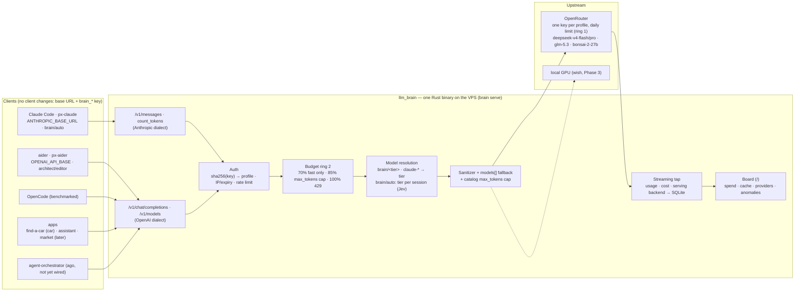

# The API layer: what it abstracts and how

One responsibility: receive requests in one of the two standard dialects
and reply in the same dialect, deciding model and budget on its own. The
client only changes its base URL and key; it doesn't know what's behind
it. Today that is a key-authenticated **reverse proxy** in front of
OpenRouter (`brain serve`, module `crates/brain/src/proxy/`).

{/* diagram: 01-system-overview */}

## What the proxy does to a request

In order, as in `proxy/mod.rs` (Phase 1, live since 2026-09-20):

| Step | What happens | Code |
|------|--------------|------|
| **Endpoints** | `/v1/messages` + `/v1/messages/count_tokens` (Anthropic), `/v1/chat/completions` + `/v1/models` (OpenAI); errors always in the client's dialect | `proxy/mod.rs` |
| **Auth** | `brain_<profile>_…` key → sha256 lookup → profile; expiry, IP allowlist, per-key/per-user rate limit, IP block after repeated failures | `auth.rs`, [Auth flow](./auth-flow.md) |
| **Model resolution** | `brain/<tier>` → the tier's model; `claude-*`, `sonnet`, `opus`, `haiku` or no model → the profile's default tier; a configured model id → its tier; any other `vendor/model` passes as-is | `proxy/sanitize.rs` |
| **`brain/auto`** | tier chosen once per session by a decision model | `proxy/route.rs`, [Auto routing](./auto-routing.md) |
| **Budget (ring 2)** | spend today / this month vs the profile's limits: 70% → `fast`, 85% → `max_tokens` cap, 100% → 429 | `budget.rs`, [Budget](./budget.md) |
| **Output cap** | `max_tokens` capped to the smaller of the provider's max (OpenRouter catalog, refreshed hourly) and the tier's `max_output_tokens` | `catalog.rs` |
| **Shaping** | Anthropic: the sanitizer drops the fields non-Claude models reject and turns mid-conversation `system` turns into user turns ([why](./client-compatibility.md)); OpenAI: adds the tier's `models[]` fallback chain and `usage.include` (the Anthropic dialect gets no fallback chain today) | `proxy/sanitize.rs` |
| **Forward** | to OpenRouter with the profile's own upstream key; `anthropic-version`, `anthropic-beta` passed through; bodies are bytes, streams are never buffered | `proxy/mod.rs` |
| **Record** | a tap on the stream reads usage, cost and the serving backend, one row per request (refusals too) → board | `proxy/tap.rs`, `proxy/usage_parse.rs` |

There is **no translator**: OpenRouter natively serves both
`/api/v1/chat/completions` and `/api/v1/messages`, so each dialect goes
through unchanged apart from the shaping above ([Stack](../analysis/stack.md)).
A translator (tool calls ↔ function calling, SSE events, `thinking` ↔
`reasoning_content`, `cache_control`) only becomes necessary if a
provider that speaks neither dialect joins; claude-code-router and
LiteLLM already have that mapping.

## Exposed aliases

`/v1/models` returns `brain/auto` (with its rungs), a `brain/<tier>`
alias for each configured tier (`fast`, `reasoning`, `medium`, `agent`,
`max`) and the tiers' concrete model ids. Changing the model behind an
alias touches no client.

## Routing by task weight

*"A strong model for a grep is a waste: can the layer pick the model per
action?"* What exists, and what is deliberately not done:

1. **Per role, client-side (done).** Claude Code runs a main model and a
   "haiku" one for background work (summaries, titles, `Explore`):
   `px-claude` maps them to `brain/auto` and `brain/fast`. aider splits
   architect / editor the same way. The cheap model belongs to a whole
   cheap sub-conversation, not to a cheap turn inside an expensive one.
2. **Per session, in the proxy (done: `brain/auto`).** → [Auto routing](./auto-routing.md)
3. **Per request (rejected).** A classifier on every turn pays twice in an
   agent loop: each model has its own prompt cache, so switching re-reads
   the whole prefix at full price, and the turn that *looks* light ("call
   grep") is where a weak model breaks the tool call. Numbers in
   [Auto routing](./auto-routing.md#why-per-session-and-not-per-turn).
4. **Escalation on failure (not built)**, below.

Measured on `ago-0001` ([Phase 1](../phase-1.md#agents-compared-through-the-proxy)):
Claude Code needs `agent` for a reliable loop, OpenCode solves the same
task on `fast` at 1/30 of the cost. Changing the *tool* moved the cost
more than any per-turn routing could.

## Escalation

:::note Not built yet (Phase 2)
:::

The reliable signal is the **failure of the lower tier**, not how the
request looks: start cheap, move up a rung of the ladder when tests or
tool calls fail.

- **aider**: `--auto-test` feeds failing test output back; the layer
  would recognise it and raise the tier.
- **Claude Code**: a `PostToolUse` hook on failing tests/lint could mark
  the next request (header) to force a higher tier.
- **Manual (works today)**: `/model brain/agent` in Claude Code, `/model`
  in aider, or `ANTHROPIC_MODEL=brain/agent px-claude`.

## Provider routing (Exacto)

The tier picks the **model**; OpenRouter picks the **provider** that
serves it (16 for `deepseek-v4-pro`, from 0.96 to 1.91 $/M input). Some
providers serve the same open model with broken tool calls (truncated
JSON arguments, missing calls). **Exacto** sorts providers by measured
tool-call accuracy:

- **Auto Exacto** is on by default for every request that carries
  `tools` — every Claude Code and OpenCode turn — as long as the request
  sets no `provider.sort`, which the proxy never does.
- `model:exacto` forces it on one model (also without tools) and works
  with the `models` fallback chain; the catalog lookup strips the suffix.
  `ANTHROPIC_MODEL=deepseek/deepseek-v4-pro:exacto px-claude` tries it
  with no config change; `model:` in `tiers.yaml` makes it the default.
- The cost is that a quality-sorted provider may not be the cheapest.

The proxy records which backend served each request; pinning one per
model (`provider.order`) is the next step, because the prompt cache lives
in the backend ([Cache](./cache.md#which-backend-serves-the-turn-2026-09-22)).
A/B of `:exacto` on `ago-0001` is in [Phase 1](../phase-1.md#agents-compared-through-the-proxy).
