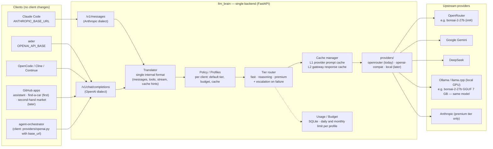

# The API layer: what it abstracts and how

One responsibility: receive requests in one of the two standard dialects
and reply in the same dialect, deciding provider, model, cache and budget
on its own. The client doesn't know what's behind it.

{/* diagram: 01-system-overview */}

## Components

| Component | Responsibility | Note |
|-----------|----------------|------|
| **Endpoints** | `/v1/messages` (Anthropic), `/v1/chat/completions` + `/v1/models` (OpenAI) | SSE streaming in both dialects |
| **Translator** | dialect → single internal format → provider dialect | The most delicate piece: tool schema, stream, thinking, cache hints |
| **Profiles** | api_key → profile: default tier, budget, cache policy | One per client: `dev`, `market`, `car`, `assistant` |
| **Tier router** | `brain/*` and `claude-*` aliases → tier → (provider, model) from `tiers.yaml` | routing by alias; no classifier in Phase 1 ([why](#routing-by-task-weight)) |
| **Escalation** | failure signal → retry on a higher tier | v2 |
| **Cache manager** | L1 (provider prompt cache, translated) + L2 (response cache) | [Cache](./cache.md) |
| **Usage** | tokens, cache hits, cost, per profile, daily and monthly | `usage.py` ported to `usage.rs` + SQLite |

## Translator: the main technical risk (deferred)

:::tip Update
OpenRouter natively exposes both `/api/v1/chat/completions` and
`/api/v1/messages` (Anthropic format, verified). In Phase 1 the layer is
therefore an **aware reverse proxy** (profile, alias, budget, usage) and
passes formats through as they are. The list below applies when a
non-compatible provider joins. See [Stack](../analysis/stack.md).
:::

It must faithfully handle:

- SSE streaming with the Anthropic events (`message_start`,
  `content_block_delta`, `content_block_stop`, `message_delta`…)
- `tool_use` / `tool_result` blocks ↔ OpenAI function calling
- `system` as an array of blocks with `cache_control`
- `thinking` blocks ↔ `reasoning_content` (DeepSeek) or dropped
- `POST /v1/messages/count_tokens` (Claude Code calls it)
- `anthropic-beta`, `anthropic-version` headers (accept and ignore)
- `claude-*` model ids sent by the client → tier (Claude Code uses one
  model for "haiku" tasks and one for the main: both must be mapped)

Not to be written from scratch: claude-code-router and LiteLLM already
have the mapping. See [decisions](../decisions.md).

## Escalation

The best routing signal is not "how complex the request looks" (regex)
but **the failure of the lower tier**:

- **aider**: with `--auto-test` it feeds the failing test output back to
  the model; the layer recognizes the pattern and raises the tier.
- **Claude Code**: a `PostToolUse` hook on failing tests/lint can mark the
  next request (header or prefix) to force `reasoning`.
- **manual**: `/model reasoning` in aider, `brain/reasoning` alias from
  `/v1/models`.

## Routing by task weight

*"A strong model for a grep is a waste: can the layer pick the model per
action?"* Three levels, from what exists to what is deliberately not done:

1. **Per role, client-side (done).** Claude Code already runs two models:
   the main one for the conversation and a "haiku" one for background
   work (summaries, titles, the `Explore` subagent). `px-claude` maps them
   to `brain/agent` and `brain/fast`; a subagent can name its own model.
   OpenCode and aider (`--architect` / `--editor-model`) split the same
   way. This is where the cheap model belongs: a whole cheap
   sub-conversation, not a cheap turn in the middle of an expensive one.
2. **Per request, in the proxy (not in Phase 1).** A classifier (rules
   on the request shape or a cheap model, as claude-code-router and
   `openrouter/auto` do) could send "light" turns to `fast`. Two costs
   make it a bad default for an agent loop: every turn carries the whole
   context, and each model has its own prompt cache, so switching mid-loop
   re-reads the 60 KB system prompt at full price; and the turn that
   *looks* light — "call grep" — is the one where a weak model produces
   a broken tool call and starts the retry loop the `agent` tier was
   introduced to stop. The grep itself runs on the laptop for free; what
   is paid is the decision to run it, and that needs the context.
3. **Escalation on failure (Phase 2, above).** The reliable signal is the
   outcome, not the look of the request: start cheap, raise the tier when
   tests or tool calls fail.

Measured on `ago-0001` ([Phase 1](../phase-1.md#agents-compared-through-the-proxy)):
Claude Code needs `agent` for a reliable loop, OpenCode solves the same
task on `fast` at 1/30 of the cost. Changing the *tool* moved the cost
more than any per-turn routing could.

## Provider routing (Exacto)

The tier picks the **model**; OpenRouter picks the **provider** that
serves it (16 for `deepseek-v4-pro`, from 0.96 to 1.91 $/M input). The
default order is by price, and some providers serve the same open model
with broken tool calls (truncated JSON arguments, missing calls): the
agent retries or loops. **Exacto** is a provider sort by measured
tool-call accuracy, not a different model:

- **Auto Exacto** is on by default since 2026-03 for every request that
  contains `tools` — every Claude Code and OpenCode turn — as long as the
  request sets no explicit `provider.sort`, which the proxy never does.
- `model:exacto` forces it on a given model (also on requests without
  tools) and still works with the `models` fallback chain; the catalog
  lookup strips the suffix. `ANTHROPIC_MODEL=deepseek/deepseek-v4-pro:exacto
  px-claude` tries it with no config change; `model:` in `tiers.yaml`
  makes it the default.
- The cost is that a quality-sorted provider may not be the cheapest.

A/B on `ago-0001` (2026-09-22, Claude Code through the proxy, two runs
each) is in [Phase 1](../phase-1.md#agents-compared-through-the-proxy).

## Exposed aliases

`/v1/models` returns stable aliases, not models: `brain/fast`,
`brain/reasoning`, `brain/premium`. Changing the model behind an alias
touches no client.
