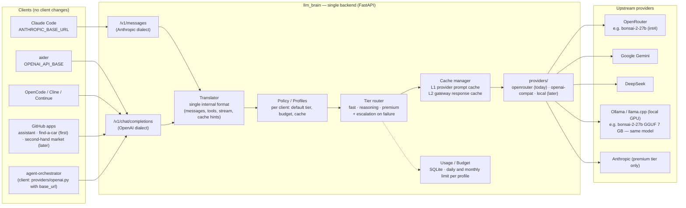

# The API layer: what it abstracts and how

One responsibility: receive requests in one of the two standard dialects
and reply in the same dialect, deciding provider, model, cache and budget
on its own. The client doesn't know what's behind it.

{/* diagram: 01-system-overview */}

## Components

| Component | Responsibility | Note |
|-----------|----------------|------|
| **Endpoints** | `/v1/messages` (Anthropic), `/v1/chat/completions` + `/v1/models` (OpenAI) | SSE streaming in both dialects |
| **Translator** | dialect → single internal format → provider dialect | The most delicate piece: tool schema, stream, thinking, cache hints |
| **Profiles** | api_key → profile: default tier, budget, cache policy | One per client: `dev`, `market`, `car`, `assistant` |
| **Tier router** | `brain/*` and `claude-*` aliases → tier → (provider, model) from `tiers.yaml` | routing by alias; no classifier in Phase 1 |
| **Escalation** | failure signal → retry on a higher tier | v2 |
| **Cache manager** | L1 (provider prompt cache, translated) + L2 (response cache) | [Cache](./cache.md) |
| **Usage** | tokens, cache hits, cost, per profile, daily and monthly | `usage.py` copied from agent-orchestrator + SQLite |

## Translator: the main technical risk (deferred)

:::tip Update
OpenRouter natively exposes both `/api/v1/chat/completions` and
`/api/v1/messages` (Anthropic format, verified). In Phase 1 the layer is
therefore an **aware reverse proxy** (profile, alias, budget, usage) and
passes formats through as they are. The list below applies when a
non-compatible provider joins. See [Stack](../analysis/stack.md).
:::

It must faithfully handle:

- SSE streaming with the Anthropic events (`message_start`,
  `content_block_delta`, `content_block_stop`, `message_delta`…)
- `tool_use` / `tool_result` blocks ↔ OpenAI function calling
- `system` as an array of blocks with `cache_control`
- `thinking` blocks ↔ `reasoning_content` (DeepSeek) or dropped
- `POST /v1/messages/count_tokens` (Claude Code calls it)
- `anthropic-beta`, `anthropic-version` headers (accept and ignore)
- `claude-*` model ids sent by the client → tier (Claude Code uses one
  model for "haiku" tasks and one for the main: both must be mapped)

Not to be written from scratch: claude-code-router and LiteLLM already
have the mapping. See [decisions](../decisions.md).

## Escalation

The best routing signal is not "how complex the request looks" (regex)
but **the failure of the lower tier**:

- **aider**: with `--auto-test` it feeds the failing test output back to
  the model; the layer recognizes the pattern and raises the tier.
- **Claude Code**: a `PostToolUse` hook on failing tests/lint can mark the
  next request (header or prefix) to force `reasoning`.
- **manual**: `/model reasoning` in aider, `brain/reasoning` alias from
  `/v1/models`.

## Exposed aliases

`/v1/models` returns stable aliases, not models: `brain/fast`,
`brain/reasoning`, `brain/premium`. Changing the model behind an alias
touches no client.
