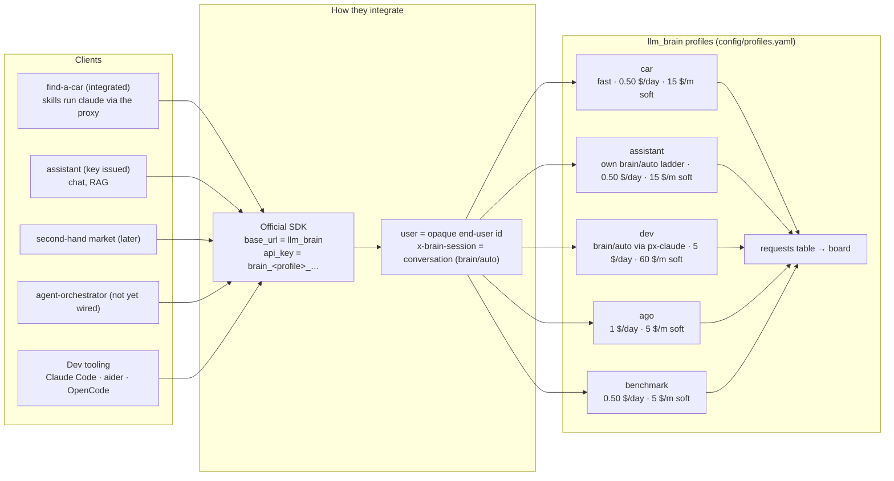

# Integration with the existing apps

Every client is a **profile** in `config/profiles.yaml` with its own
client key, budget and default tier; the key decides the profile. No
custom SDK: the official OpenAI or Anthropic SDK (or the `claude` CLI)
with `base_url` = llm_brain and the app's key ([Compatibility](./client-compatibility.md)).

| App | Profile | Status | Budget (day / month soft) |
|-----|---------|--------|---------------------------|
| **find-a-car** (second-hand cars: valuation, extraction from listings) | `car` | **integrated** (2026-09-20) | 0.50 $ / 15 $ |
| **assistant** (local chat, RAG) | `assistant` | client key issued, own `brain/auto` router configured | 0.50 $ / 15 $ |
| agent-orchestrator | `ago` | profile and upstream key only, not wired | 1 $ / 5 $ |
| dev tooling (Claude Code, aider) | `dev` | daily use through `px-claude` / `px-aider` | 5 $ / 60 $ |
| second-hand market | — | later | — |

{/* diagram: 04-app-integration */}

## find-a-car

The app's skills run the `claude` CLI as a subprocess. `claude_env()` in
the app sets `ANTHROPIC_BASE_URL` / `ANTHROPIC_AUTH_TOKEN` for that
subprocess from `BRAIN_BASE_URL` / `BRAIN_CAR_KEY` in the app's
git-ignored `.env`, so every skill run is a `car` request through the
proxy (verified live: one skill run from the Docker app = 4 proxied
requests). The change itself was made by aider through the proxy for
0.002 $.

## assistant

Its own router in `profiles.yaml` replaces the global coding-agent ladder
for [`brain/auto`](./auto-routing.md): `fast` for greetings and lookups,
`medium` for summaries and drafting, `agent` for long analysis; fallback
`fast`. The app should name each conversation with the `x-brain-session`
header so the tier is decided once per conversation; the app-side wiring
is not recorded here yet.

## What is not built for apps

- **Server-side, versioned system prompts** per profile
  ([why](./cache-logic.md)): designed, not built (`config/prompts/` is
  empty).
- **L2 response cache**: `l2_cache: exact` is set for `assistant` and
  `car` but is only a config field today; nothing is cached server-side.
