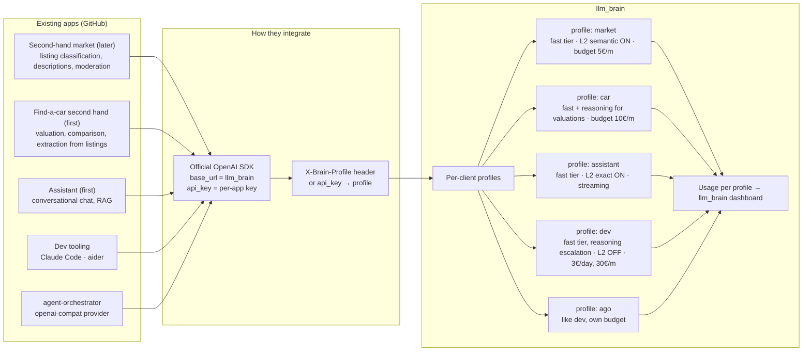

# Integration with the existing apps

Order decided (2026-09-19): **assistant and find-a-car first**, then the
second-hand market. agent-orchestrator integrates the same way, with the
`ago` profile. The repos are not public: **name and stack to be
confirmed** ([open decision](../decisions.md)).

For each of the first two apps three things are needed: the profile, the
**versioned system prompt** kept by the layer ([why](./cache-logic.md)),
and the list of LLM calls the app makes today (to estimate the budget).

The integration model is the same for all and needs no custom SDK.

{/* diagram: 04-app-integration */}

- Every app uses **the official OpenAI SDK of its language** with
  `base_url = llm_brain` and its own `api_key`. Zero dependencies on
  llm_brain in the app's code.
- The `api_key` identifies the **profile**: default tier, monthly budget,
  cache policy, streaming. Changing an app's model = changing the profile.
- Usage per profile lands in llm_brain's dashboard: one place to see how
  much each app and the dev tooling spend.

## Plausible tiers per app

| App | Tier | L2 cache |
|-----|------|----------|
| assistant (chat, RAG) — **first** | `fast` | exact |
| find-a-car (valuation, comparison, extraction from listings) — **first** | `fast` + `reasoning` for valuations | exact |
| second-hand market (listing classification, descriptions, moderation) — later | `fast` | semantic |
| agent-orchestrator (`ago`) | like `dev` | OFF |
| dev tooling (Claude Code + aider) | `fast` with escalation | OFF |
