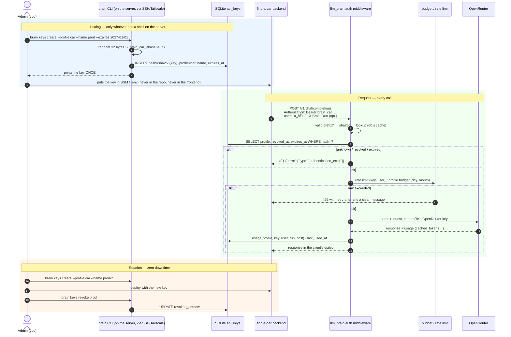

# Authentication flow: who can hold credentials and how they are used

Yes, this pattern has to be **built**, but it's small: one table, one
middleware, four CLI commands. About 150–200 lines of Python. This page
describes the exact interactions and what guarantees that **only who you
decide** can hold and use a key.

{/* diagram: 10-auth-sequence */}


## Who can obtain a key: only the admin, only on the server

The "only certain parties can hold credentials" control is not an
endpoint: it is **the absence of an endpoint**.

- **No self-service**: there is no `POST /keys`. Keys are created only
  with `brain keys create` on the server, which requires a shell (SSH with
  a key, or Tailscale). Whoever has no access to the machine cannot create
  one.
- **Every key is born bound to a profile** (`car`, `assistant`, `dev`…):
  it inherits tier, budget, cache policy. There are no "free" keys.
- **Every key has a name and an owner** (`prod`, `staging`,
  `laptop-jonny`), an **optional expiry**, and optionally an **IP/CIDR
  allowlist** (useful for the `dev` key and for a VPS with a fixed IP).
- The admin panel, if and when there is one, listens only on `127.0.0.1` /
  Tailscale. Never on the public endpoint.

## Server side: what the middleware does, in order

1. Reads `Authorization: Bearer …` **or** `x-api-key: …` (the OpenAI and
   Anthropic SDKs use different headers).
2. Checks the `brain_<profile>_<random>` format: if it doesn't match,
   `401` without touching the DB (cuts scanner noise).
3. `sha256(key)` → lookup in `api_keys` (60 s in-memory cache to avoid a
   query per request). Constant-time comparison.
4. `revoked_at` set or `expires_at` past → `401`. IP outside the allowlist
   → `403`.
5. **Rate limit** token-bucket per key (e.g. 60 req/min) and per
   `(key, user)` (e.g. 10 req/min) → `429` with `Retry-After`.
6. **Budget** of the profile, day and month, with degradation
   ([Budget](./budget.md)) → `429` at 100%.
7. Forwards to OpenRouter with the **profile's upstream key**; the client
   never sees it.
8. Writes usage with `profile`, `key_name`, `user`, `run_id`, cost,
   `cached_tokens`; updates `last_used_at`.
9. **Audit**: every `401/403` with IP and key prefix; after N failures
   from the same IP in 10 minutes, a temporary block (fail2ban-like, in
   memory).

Errors always **in the client's dialect**: Claude Code and the Anthropic
SDK expect `{"type":"error","error":{"type":"authentication_error"}}`,
the OpenAI SDK `{"error":{"message":…,"type":…}}`. That way the CLI shows
a readable message instead of a crash.

## Data model

```sql
CREATE TABLE api_keys (
  id          INTEGER PRIMARY KEY,
  key_hash    TEXT UNIQUE NOT NULL,      -- sha256, never the key
  prefix      TEXT NOT NULL,             -- "brain_car_…a1b2" for logs
  profile     TEXT NOT NULL,             -- logical FK to profiles.yaml
  name        TEXT NOT NULL,             -- "prod", "staging", "laptop"
  ip_allow    TEXT,                      -- CSV of CIDRs, optional
  created_at  TEXT NOT NULL,
  expires_at  TEXT,
  last_used_at TEXT,
  revoked_at  TEXT
);
CREATE TABLE auth_audit (ts, ip, prefix, outcome);   -- failures and revocations only
```

Profiles (tier, budget, cache, system prompt) live in `profiles.yaml`;
OpenRouter keys in `.env` / sops ([Secrets](./secrets.md)).

## Client side: what every app must do

| Rule | Why |
|------|-----|
| Key **only in the backend**, from env at startup | the frontend is public by definition |
| One configured HTTP client (`base_url`, `api_key`) | official OpenAI/Anthropic SDKs, zero custom code |
| Pass `user: <opaque id>` for every end user | per-user rate limit; never emails or real ids |
| On `401`: **don't retry**, raise an alert | the key is revoked/expired: a human is needed |
| On `429`: back off and degrade the feature (e.g. "valuation unavailable right now") | the budget is gone: the wall is intentional |
| Timeout and optional `X-Brain-Run` to correlate logs | debugging |
| Rotation: read the key from env at every startup, don't cache it forever | a deploy with the new key is enough |

## The commands

```
brain keys create  --profile car --name prod [--expires 2027-01-01] [--ip 1.2.3.4/32]
brain keys list    [--profile car]            # prefix, name, created, last use, state
brain keys revoke  --profile car --name prod
brain keys provision                          # once: creates the per-profile OpenRouter keys (management key only in the shell)
```

## What NOT to build now

- OAuth / refresh tokens / JWT: no human user authenticates to llm_brain
  ([why](./auth-topology.md)).
- HTTP endpoints for key management: the CLI on the server is enough and
  reduces the surface.
- Multi-tenant with organizations: there is one admin.
