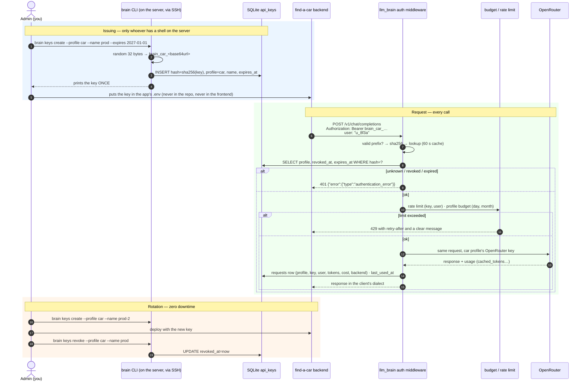

# Authentication flow: who can hold credentials and how they are used

Live since 2026-09-20 ([Phase 1 runbook](../phase-1.md)). Code:
`auth.rs` (key format, hash, checks), `proxy/mod.rs` (the chain),
`db.rs` (tables), `main.rs` (`brain keys …`). This page describes what
runs and what guarantees that **only who you decide** can hold and use a
key.

{/* diagram: 10-auth-sequence */}


## Who can obtain a key: only the admin, only on the server

The "only certain parties can hold credentials" control is not an
endpoint: it is **the absence of an endpoint**.

- **No self-service**: there is no `POST /keys`. Keys are created only
  with `brain keys create` on the server, which requires an SSH shell.
- **Every key is born bound to a profile** (`car`, `assistant`, `dev`…):
  it inherits tier, router and budget from `profiles.yaml`. There are no
  "free" keys.
- **Every key has a name** (`prod`, `laptop`…; one active key per
  profile × name), an **optional expiry** and an optional **IP/CIDR
  allowlist**.
- The key is printed once; the DB keeps only `sha256(key)` and a display
  prefix (`brain_car_…a1b2`).

## Server side: what the proxy does, in order

1. Too many recent auth failures from this IP → `429`, `retry-after: 600`.
2. Reads `Authorization: Bearer …` **or** `x-api-key: …` (the OpenAI and
   Anthropic SDKs use different headers). Missing → `401`.
3. Checks the `brain_<profile>_<token>` shape: if it doesn't match, `401`
   without touching the DB (cuts scanner noise).
4. `sha256(key)` → lookup in `api_keys`, with a 60 s in-memory cache (a
   revocation takes effect within 60 s). `last_used_at` is updated on
   each cache miss.
5. `revoked_at` set or `expires_at` past → `401`; IP (from
   `X-Forwarded-For`, Caddy is in front) outside the allowlist → `403`.
6. Profile removed from `profiles.yaml` → `403`; no
   `OPENROUTER_KEY_<PROFILE>` in the env → `503`.
7. **Rate limit** (governor): 60 req/min per key and 10 req/min per
   `(key, end user)` → `429`, `retry-after: 5`. The end user is the OpenAI
   `user` or Anthropic `metadata.user_id` (Claude Code's blob reduced to
   `cc:<session id>`).
8. **Budget** of the profile, day and month, with degradation
   ([Budget](./budget.md)) → `429` at 100%.
9. Forwards to OpenRouter with the **profile's upstream key**; the client
   never sees it.
10. Writes one row in `requests` (profile, key prefix, user, tier, model,
    tokens, cost, provider, degradation).

Every failure in steps 2–5 is written to `auth_audit` (IP, prefix,
outcome) and counts toward the IP block: 20 failures in 10 minutes block
the IP for the window.

Errors are always **in the client's dialect**, with `x-should-retry:
false` on auth errors: Anthropic
`{"type":"error","error":{"type":"authentication_error",…}}`, OpenAI
`{"error":{"message":…,"type":"invalid_api_key",…}}`. That way the CLI
shows a readable message instead of retrying.

## Data model (`db.rs`)

```sql
CREATE TABLE api_keys (
  id           INTEGER PRIMARY KEY,
  key_hash     TEXT UNIQUE NOT NULL,       -- sha256, never the key
  prefix       TEXT NOT NULL,              -- "brain_car_…a1b2" for logs
  profile      TEXT NOT NULL,              -- logical FK to profiles.yaml
  name         TEXT NOT NULL,              -- "prod", "staging", "laptop"
  ip_allow     TEXT NOT NULL DEFAULT '',   -- CSV of IPs/CIDRs, empty = any
  created_at   TEXT NOT NULL,
  expires_at   TEXT,
  last_used_at TEXT,
  revoked_at   TEXT
);
-- one active key per (profile, name)
CREATE UNIQUE INDEX api_keys_profile_name_active ON api_keys(profile, name) WHERE revoked_at IS NULL;
CREATE TABLE auth_audit (id, ts, ip, prefix, outcome);  -- failures and CLI revocations
```

Profiles (tier, budget, router) live in `config/profiles.yaml`;
OpenRouter keys in `.env` ([Secrets](./secrets.md)).

## Client side: what every app must do

| Rule | Why |
|------|-----|
| Key **only in the backend**, from env at startup | the frontend is public by definition |
| One configured HTTP client (`base_url`, `api_key`) | official OpenAI/Anthropic SDKs, zero custom code |
| Pass `user: <opaque id>` for every end user | per-user rate limit; never emails or real ids |
| Optional `x-brain-session: <conversation id>` | keeps a [`brain/auto`](./auto-routing.md) tier decision for the whole conversation |
| On `401`/`403`: **don't retry**, raise an alert | the key is revoked/expired/pinned: a human is needed |
| On `429`: back off and degrade the feature (e.g. "valuation unavailable right now") | the budget is gone: the wall is intentional |
| Rotation: read the key from env at every startup | a deploy with the new key is enough |

## The commands

```
brain keys create  --profile car --name prod [--expires 2027-01-01] [--ip 1.2.3.4/32]
brain keys list    [--profile car]            # prefix, name, created, last use, state
brain keys revoke  --profile car --name prod
brain upstream provision|sync|list            # the per-profile OpenRouter keys (management key only for the call)
```

## Out of scope

- OAuth / refresh tokens / JWT: no human user authenticates to llm_brain
  ([why](./auth-topology.md)).
- HTTP endpoints for key management: the CLI on the server is enough and
  reduces the surface.
- Multi-tenant with organizations: there is one admin.
