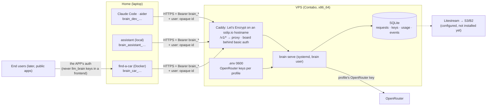

# Authentication, topology and persistence

llm_brain talks **only to backends and CLIs** (machine → machine). Apps
can run anywhere (at home, a VPS, AWS); llm_brain itself runs on one VPS.
The step-by-step flow (issuing, request, rotation, what the proxy does) is
in [Authentication flow](./auth-flow.md).

## Static per-app keys, no refresh tokens

The right pattern is OpenRouter's, Anthropic's, Stripe's: **a long-lived
static API key, one per app, revocable, rotatable**. Refresh tokens serve
user sessions in browsers, where the token can be stolen from the client;
here the key sits in a server and never passes through a browser.

What actually provides security, in order:

1. **One key per app and a budget per profile**: a stolen key spends at
   most its daily cap and is revoked on its own ([Secrets](./secrets.md)).
2. **TLS always** (Caddy, Let's Encrypt).
3. **Never in the frontend**: the llm_brain key sits in the app's backend;
   the browser/mobile authenticates **to the app**, with the app's auth.
4. **Rotation with overlap**: new key → deploy → revoke old. Every 90 days
   or on suspicion.
5. **Rate limit per key and per end user**: the app passes
   `user: <opaque id>`; without it one user of the app could burn the
   app's budget — blocked by the cap, but still an outage.

If short-lived credentials were ever needed (a client on untrusted
devices), the addition is local: an endpoint that exchanges the static key
for a 1-hour JWT. Not built, not planned.

## Where llm_brain runs: one VPS

A **Contabo** VPS (x86_64, 4 vCPU, 8 GB, Ubuntu 24.04) since 2026-09-20:
`brain serve` under systemd on `127.0.0.1:8080`, Caddy in front with
automatic HTTPS on an sslip.io hostname. Hetzner was the original plan;
the reasoning ([Hosting](../analysis/hosting-costs.md)) is unchanged.
Runbook: [Deploy on a VPS](../deploy-vps.md). The budget counters live in
SQLite: **a single instance**.

{/* diagram: 09-topology */}

| Route | Auth |
|-------|------|
| `/v1/*` | client key (Bearer or `x-api-key`), no exceptions |
| `/`, `/api/summary` (board) | Caddy basic auth |
| `/health` | open, returns `ok` |
| `/api/hello` (Claude Code probe) | no key checked by `brain`, always `204` |

Plus: per-key, per-user and per-IP-failure limits in the proxy, no CORS
(no browser should call it), SSH with keys only, ufw open on SSH, 80 and 443 only.

## Where each app keeps its key

Common rule: the key enters the process as an **environment variable at
startup**, never hard-coded, never in a committed file.

| Where it runs | How |
|---------------|-----|
| **llm_brain itself** (VPS, systemd) | `EnvironmentFile=/opt/llm_brain/.env` (0600, owner `brain`) |
| **Docker app** (find-a-car) | the app's git-ignored `.env`, passed as env to the container |
| **Local CLIs** (Claude Code, aider) | shell env from the git-ignored `deploy/server.local.env` (`BRAIN_BASE_URL`, `BRAIN_DEV_KEY`), read by `px-claude` / `px-aider` |
| **AWS**, if an app moves there | SSM Parameter Store (SecureString) mapped to env |

## Persistence and backup

| What | Where | Backup |
|------|-------|--------|
| requests, usage snapshots, keys (hash), audit, events, bench runs | one SQLite file on the VPS (`/opt/llm_brain/data/brain.db`) | **Litestream → S3/B2: not installed yet** (`deploy/litestream.yml` ready) |
| per-profile OpenRouter keys | `/opt/llm_brain/.env` on the VPS and the admin's local `.env` | recreate with `brain upstream provision --force` if lost |
| plaintext client keys | **nowhere**: only the hash | if lost, issue a new one and revoke |
| config (profiles, tiers, routers) | `config/*.yaml` in the repo, copied to the VPS | the repo |
| OpenRouter management key | the admin's password manager | — |

Losing the DB today loses spend history and client-key hashes (the keys
must be reissued); the budget ring 1 on OpenRouter is unaffected.

## agent-orchestrator

Not wired yet (the `ago` profile and its upstream key exist). Same
mechanism when it is: a `brain_ago_…` key as env, its OpenAI-compatible
provider pointed at llm_brain.
