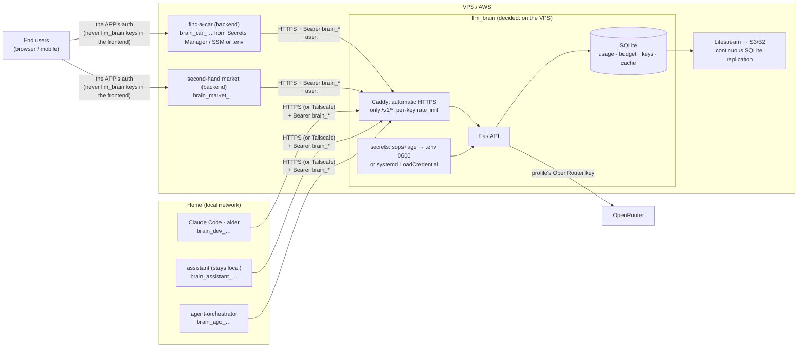

# Authentication, topology and persistence

Context (2026-09-19): today all apps are local; **the assistant stays
local**, find-a-car and the second-hand market **will go to a VPS or
AWS**; agent-orchestrator is already remote. Hence the question: is an
authentication system with token refresh needed?

## Answer: static per-app keys, no refresh

The step-by-step flow (issuing, request, rotation, what the middleware
does) is in [Authentication flow](./auth-flow.md).

llm_brain talks **only to backends** (machine → machine). The right
pattern is OpenRouter's, Anthropic's, Stripe's: **a long-lived static API
key, one per app, revocable, rotatable**. Refresh tokens serve user
sessions in browsers, where the token can be stolen from the client; here
the key sits in a server and never passes through a browser.

What actually provides security, in order:

1. **One key per app and a budget per profile**: a stolen key spends at
   most its daily cap and is revoked on its own ([Secrets](./secrets.md)).
2. **TLS always** (Caddy does automatic HTTPS).
3. **Never in the frontend**: the llm_brain key sits in the app's backend;
   the browser/mobile authenticates **to the app**, with the app's auth.
4. **Rotation with overlap**: new key → deploy → revoke old. Every 90 days
   or on suspicion.
5. **Rate limit per key** and, in public apps, **per end user**: the app
   passes `user: <opaque id>` (a standard field of the OpenAI SDK);
   llm_brain limits per (key, user) and flags anomalies. Without this, one
   user of the app could burn the app's budget — blocked by the cap, but
   still an outage.

If short-lived credentials were ever needed (e.g. a client running on
untrusted devices), the addition is local: `POST /auth/token` that
exchanges the static key for a 1-hour JWT. Not now.

## Where llm_brain runs: decided, on the VPS

Decision of 2026-09-19: **llm_brain on a Hetzner VPS**, protected public
HTTPS endpoint, apps free to be on AWS, a VPS or at home (costs and
reasoning in [Hosting](../analysis/hosting-costs.md)). The budget counters
live in SQLite: **a single instance**. The comparison that led to the
choice:

| | llm_brain on the VPS | llm_brain at home + Tailscale |
|---|---|---|
| Remote apps | VPS local network or HTTPS | must join the tailnet (fine on EC2/VPS, awkward on ECS/Lambda) |
| Local clients (CLI, assistant) | public HTTPS, or Tailscale to expose nothing | local network |
| Availability | the VPS's | the home connection's |
| Secret store | sops+age → `.env` 0600 at deploy | `.env` 0600 |
| Exposure | public endpoint: TLS + keys + rate limit + only `/v1/*` | no open ports |

{/* diagram: 09-topology */}

Public exposure is mitigated like this: Caddy in front (HTTPS, only the
`/v1/*` and `/health` routes), rate limit per key and per IP, no CORS (no
browser should call it), admin panel only via Tailscale or `127.0.0.1`.

## Where each app keeps its key

| Where it runs | How it receives `BRAIN_API_KEY` |
|---------------|---------------------------------|
| **AWS** (ECS/EC2/Lambda) | **SSM Parameter Store** (SecureString, free) or Secrets Manager; ECS maps it to env with `secrets:` in the task definition, Lambda reads it at startup |
| **VPS with docker compose** | `.env` 0600 generated at deploy by `sops -d secrets.enc.yaml`, or Docker secrets; never the plaintext file in the repo |
| **VPS with systemd** | `LoadCredential=` (the process reads it from `$CREDENTIALS_DIRECTORY`) |
| **Local** (assistant, CLI) | `.env` 0600 or `pass`; Claude Code in `settings.json` → `env` |

Common rule: the key enters the process as an **environment variable at
startup**, never hard-coded, never in a committed file.

## Persistence and saving

| What | Where | Backup |
|------|-------|--------|
| usage, budget, keys (hash), L2 cache, eval reports | one SQLite file on the VPS | **Litestream** → S3/B2: continuous replication, restore to the second; cost ≈ 0 |
| per-profile OpenRouter keys | `secrets.enc.yaml` encrypted with sops+age, **committed** | the repo itself; the age key in the password manager |
| plaintext client keys | **nowhere**: only the hash | if lost, regenerate and rotate |
| per-profile system prompts | `config/prompts/<profile>@<version>.md` | the repo |
| OpenRouter management key | the admin's password manager | — |

Full restore of llm_brain = clone the repo + age key + `litestream
restore`. Nothing else to remember.

## What changes for agent-orchestrator

It is already remote: it receives `brain_ago_…` through the same mechanism
of the platform it runs on and points `providers/openai.py` at llm_brain.
Nothing special.
