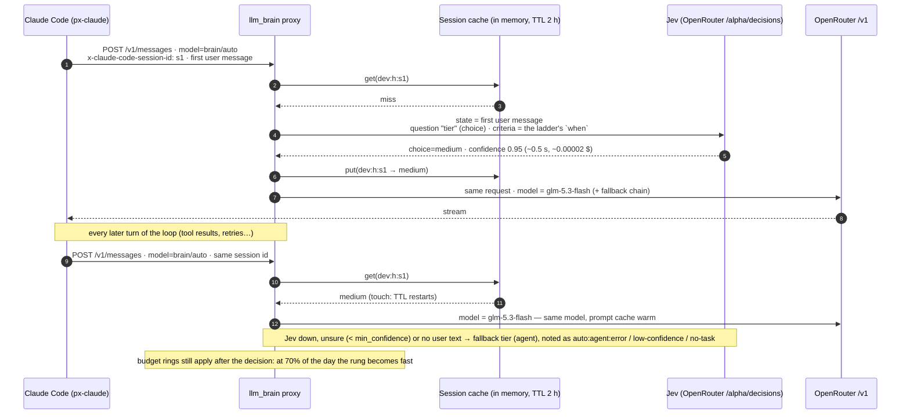

# Auto routing: one decision per session

*"A strong model for a grep is a waste, but switching models mid-loop
breaks the cache and the tool calls. Can the layer decide once, at the
start, from what the task looks like?"* Yes — that is `brain/auto`
(2026-09-22).

{/* diagram: 12-auto-routing */}


## How it works

1. A client sends `model: brain/auto`. The proxy identifies the
   **session**: the `x-brain-session` header (apps name their
   conversation), else Claude Code's `x-claude-code-session-id`, else a
   hash of the first user message (the same fingerprint OpenRouter uses
   for its own routers), scoped to the profile.
2. On the **first turn** of a session, the first user message goes to a
   **decision model**: [Jev](https://openrouter.ai/typesafe)
   (`typesafe/jev-1.13`) through OpenRouter's `/api/alpha/decisions`
   endpoint, paid by the profile's own key. Jev is not an LLM: it answers a
   *typed* question ("which rung?") with a probability per option and
   generates no text. Measured: 0.3–0.9 s, ~0.00002 $ per decision, 3/3
   correct on tasks of three weights.
3. The answer is a rung of the **ladder** in `tiers.yaml`; each rung is a
   tier plus a `when` sentence, and those sentences are the criteria the
   model reads. The choice is kept in memory for the session
   (`session_ttl_s`, sliding) and **every later turn of that session goes
   to the same tier**: prompt cache warm, no "light-looking" turn on a
   model that breaks the tool call.
4. If Jev fails, answers below `min_confidence`, or there is no user text
   to read (a session starting with a tool result), the `fallback` tier
   is used — `agent`, the proven tool-loop tier — and the request still
   goes through. The note column of the board says which case it was:
   `auto:<tier>:decided | session | low-confidence | error | no-task`.
5. Budget rings apply *after* the decision: at 70 % of the day the rung
   becomes `fast` like any other request.

## The ladder (2026-09-22)

| Rung | Tier | Model | $/task (Claude Code, measured profile) | Providers |
|------|------|-------|----------------------------------------|-----------|
| light | `fast` | deepseek-v4-flash | 0.013 | 15 |
| medium | `medium` | glm-5.3-flash | 0.029 | 32 |
| heavy | `agent` | deepseek-v4-pro | 0.106 | 16 |
| max | `max` | glm-5.3 | 0.122 | 34 |

`medium` and `max` are new and **not yet benchmarked**: `agent` is the
only rung with a measured pass rate on `ago-0001`. The board's *Auto
routing* section shows sessions per rung and what the same tokens would
have cost on the `baseline` tier (`agent`, what `px-claude` used before),
so the saving is a number, not a feeling. Promotion or demotion of a rung
follows the benchmark, as for any tier.

## One ladder per kind of client

The global `router` in `tiers.yaml` is written for a coding agent (its
`context` sentence and the rungs' `when` criteria talk about files and
refactors). An app's messages are something else, so a **profile can
carry its own `router`** in `profiles.yaml`, which replaces the global one
for that profile: its own context sentence, rungs, fallback and baseline.

The `assistant` profile (chat + RAG) has one: `fast` for greetings,
short factual questions, lookups and follow-ups; `medium` for
explanations, summaries, comparisons and drafting; `agent` for
multi-step analysis and long structured writing. Fallback `fast` (a chat
answer on the cheap tier is never a disaster), baseline `medium`. Tried
on four real chat messages before shipping: greeting → `fast` (1.00),
document lookup → `fast` (0.43, below `min_confidence`, so the fallback —
also `fast`), "compare the two quotes" → `medium` (0.98), "write the full
business plan" → `agent` (0.99).

### In the app

```python
from openai import OpenAI
client = OpenAI(base_url=f"{BRAIN_BASE_URL}/v1", api_key=BRAIN_ASSISTANT_KEY)
client.chat.completions.create(
    model="brain/auto",
    messages=history,                                   # the whole conversation, as for context
    stream=True,
    extra_headers={"x-brain-session": conversation_id}, # one decision per conversation
)
```

Without the header the proxy keys the session on the first user message,
which works as long as the app sends the full history every turn. The
board shows the assistant's sessions per rung like any other profile.

## Why per session and not per turn

Per-turn routing (what `openrouter/auto` and claude-code-router do) pays
twice inside an agent loop: each model has its own prompt cache, so a
switch re-reads the 60 KB system prompt at full price; and the turn that
looks trivial ("call grep") is where a weak model emits the broken tool
call that starts a retry loop. Deciding once from the human's request
keeps the loop on one model and still sends the trivial *sessions* to the
cheap rungs. The cases this misses — a session that starts light and turns
heavy — are for escalation on failure (Phase 2) or `/model brain/agent` by
hand.

## Alternatives checked

| | Decides where | Latency | Ladder is ours | Session stickiness | Verdict |
|---|---|---|---|---|---|
| `openrouter/auto` (plugin `auto-router`, `allowed_models`, `cost_tier`) | OpenRouter, ~30 task types, ranked by market spend | ~0 | no: coarse `cost_tier`, its own ranking | yes (fingerprint) | blind to our budgets; Anthropic dialect not documented |
| **Jev via OpenRouter** | our proxy | 0.3–0.9 s once per session | yes | ours | **chosen** |
| [Laya](https://brainfunctioncollapse.com/laya) (local, 322M, 21 ms) | our proxy | 21 ms | yes | ours | same shape, needs a Python server on the VPS; the exit if we ever want zero external dependencies |

## Usage

```bash
px-claude                                    # main model brain/auto (brain setup claude-code --proxy)
ANTHROPIC_MODEL=brain/agent px-claude        # pin a tier, skip the decision
curl $BRAIN_BASE_URL/v1/models -H "Authorization: Bearer $BRAIN_DEV_KEY"   # brain/auto listed with its rungs
```

Config: the `router:` block of [`tiers.yaml`](../configuration.md#configtiersyaml).
Code: `proxy/route.rs` (session cache, decision call, both dialects),
tests with a mocked decisions endpoint.
