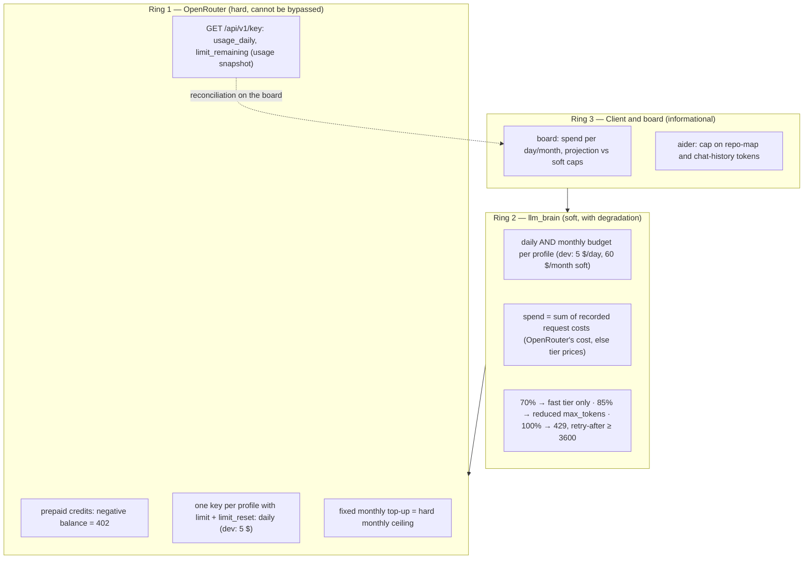

# Budget and cost control

Primary requirement: **never go over budget**, ahead of features. Chats
are cheap; **agents and coding** are not, because their volume is
unpredictable. So: a daily limit, a monthly one, and gradual degradation
before the wall.

## What OpenRouter enforces on its own

Verified on the official documentation (2026-09-19):

| Mechanism | What it does | Field |
|-----------|--------------|-------|
| Prepaid credits | You can't spend more than you loaded; negative balance → `402` even on free models | — |
| Per-key limit | Spending cap per API key, with **daily**, weekly or monthly reset | `limit`, `limit_reset: "daily"` (reset at midnight UTC) |
| Held-cost | Requests whose estimated cost (input + `max_tokens`) doesn't fit the balance are rejected **before** reaching the provider | `in_flight_budget_exhausted` |
| Usage readout | Spend per key per day/week/month | `GET /api/v1/key` → `usage_daily`, `usage_weekly`, `limit_remaining` |
| Provisioning API | Key creation from code with `limit` and `limit_reset` | `POST /api/v1/keys` |

Hence **one OpenRouter key per profile** (`brain upstream provision`),
each with a daily `limit`: the ceiling no bug in the layer can exceed.

## The three rings

{/* diagram: 06-budget-rings */}

### Ring 1 — OpenRouter (hard)
The wall: one key per profile with `limit_reset: daily`, plus the fixed
monthly credit top-up (once gone, `402` for everyone — needs no code).
`brain usage snapshot` (and the refresh loop of `brain serve`) stores
`GET /api/v1/key` per profile, so the board can reconcile the proxy's
counters with OpenRouter's.

### Ring 2 — llm_brain (soft, with degradation)
`budget.rs`, checked on every proxied request (not on `count_tokens`).
Spend is the sum of the recorded request costs (OpenRouter's `usage.cost`,
else the tier prices) since midnight UTC and since the 1st of the month;
the higher of the two percentages decides:

| Spend (max of day %, month %) | Action | Board note |
|-------------------------------|--------|------------|
| < 70% | normal | — |
| 70–85% | every request goes to the `fast` tier (including `agent` and `brain/auto`) | `fast-only` |
| 85–100% | `fast`, and `max_tokens` capped at 2048 | `max-tokens` |
| ≥ 100% | `429` in the client's dialect, `retry-after` = time to the reset (at least 3600 s), `x-should-retry: false`, so Claude Code **doesn't retry** and shows "budget exhausted" ([why](./client-compatibility.md#responses)) | `blocked` |

Independently of the budget, `max_tokens` is always capped to the
provider's max and the tier's `max_output_tokens` (the 89k-token runaway
of 2026-09-20), see [API layer](./api-layer.md).

:::note Not built
A pre-call cost estimate (input × price + `max_tokens` × price) to reject
a single out-of-scale request; OpenRouter's held-cost covers the extreme
case.
:::

### Ring 3 — Client and board (informational)
Doesn't block, informs: the board shows spend per profile per day and
month with the projection against the soft caps; in aider, caps on
repo-map and chat-history tokens. A Claude Code statusline with the day's
spend is an idea, not built.

## Budget per profile

In USD, from `config/profiles.yaml`. The daily figure is a **peak cap**
(heavy days), not a pace: the **monthly** soft limit is what keeps the
pace, and they are two different mechanisms.

What a real day costs (2026-09-20, the first full day of Claude Code
through the proxy): **≈ 2.2 $** for 286 requests, 124 of them on
`deepseek-v4-pro` with ~60k-token contexts. At the then 3 $ cap the 70%
ring kicked in at 18:38 UTC and forced 48 requests to `fast` — exactly
the "it works worse now" the user sees — so `dev` was raised to 5 $/day
and 60 $/month soft.

| Profile | $/day (hard on the OpenRouter key; ring 2 too) | $/month (soft, ring 2) | Notes |
|---------|------|------|------|
| `dev` (Claude Code + aider) | **5.00** (3.00 until 2026-09-20) | **60** (30 until 2026-09-20) | sustainable pace ≈ 2 $/day: at 5 $/day every day, the monthly soft cap is hit by day 12 |
| `ago` (agent-orchestrator) | 1.00 | 5 | separate budget |
| `benchmark` | 0.50 | 5 | separate key, never at the expense of `dev` ([Benchmark](./benchmark.md)) |
| `assistant` | **0.50** (0.20 until 2026-09-22) | **15** (3 until 2026-09-22) | own `brain/auto` ladder |
| `car` (find-a-car) | **0.50** (0.20 until 2026-09-22) | **15** (3 until 2026-09-22) | almost only `fast` |
| `market` (later) | — | — | when it joins |

Hard monthly ceiling: the OpenRouter credit top-up. Hosting (the VPS) is
outside OpenRouter, see [Hosting](../analysis/hosting-costs.md). The
original project goal stays **< 40 €/month** in total; `dev`'s 60 $ soft
cap is the ceiling, not the expected spend.

Changing a limit is two steps: edit `profiles.yaml` (ring 2 follows after
a restart of `brain serve`) and `brain upstream sync --only <profile>`
(ring 1: the OpenRouter key's limit is PATCHed in place, the secret does
not change).

No LiteLLM for any of this: OpenRouter's per-key limits plus ~150 lines of
`budget.rs` over the SQLite `requests` table (see [Stack](../analysis/stack.md)).
