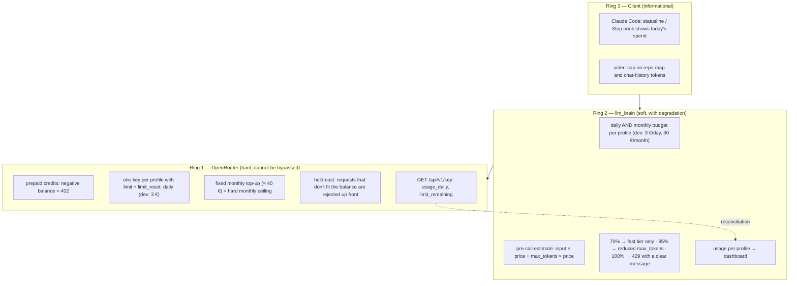

# Budget and cost control

Primary requirement: **never go over budget**, ahead of features. Chats
are not a problem (they're cheap); **agents and coding use** are, because
their volume is unpredictable. We need a daily limit and gradual
degradation, not just a wall.

## Does OpenRouter keep cost under control? Yes, if configured this way

Verified on the official documentation (2026-09-19):

| Mechanism | What it does | Field |
|-----------|--------------|-------|
| Prepaid credits | You can't spend more than you loaded; negative balance → `402` even on free models | — |
| Per-key limit | Spending cap per API key, with **daily**, weekly or monthly reset | `limit`, `limit_reset: "daily"` (reset at midnight UTC) |
| Held-cost | Requests whose estimated cost (input + `max_tokens`) doesn't fit the balance are rejected **before** reaching the provider | `in_flight_budget_exhausted` |
| Usage readout | Spend per key per day/week/month | `GET /api/v1/key` → `usage_daily`, `usage_weekly`, `limit_remaining` |
| Provisioning API | Key creation from code with `limit` and `limit_reset` | `POST /api/v1/keys` |

Conclusion: **one OpenRouter key per profile** (`dev`, `market`, `car`,
`assistant`, `benchmark`), each with a daily `limit`. That is the ceiling
no bug in the layer can exceed.

## The three rings

{/* diagram: 06-budget-rings */}

### Ring 1 — OpenRouter (hard)
The wall. One key per profile with `limit_reset: daily`. The layer reads
`GET /api/v1/key` to reconcile its own counters with the real ones.

### Ring 2 — llm_brain (soft, with degradation)
agent-orchestrator's `core/usage.py` already has `BudgetConfig.max_per_day`
and `UsageTracker.check_budget`. To be extended per profile and with a
**degradation policy** before the block:

| Day's spend | Action |
|-------------|--------|
| < 70% | normal |
| 70–85% | `reasoning` disabled, everything on `fast` |
| 85–100% | reduced `max_tokens`, L2 cache forced ON where possible |
| 100% | `429` with an error in the client's dialect; for Claude Code `retry-after: 3600` + `x-should-retry: false` so it **doesn't retry** and shows "budget exhausted" ([why](./client-compatibility.md#responses)) |

Plus a **pre-call estimate** (input tokens × price + `max_tokens` × price,
prices from `/api/v1/models`) to reject a single out-of-scale request,
like OpenRouter's held-cost.

### Ring 3 — Client (informational)
Doesn't block, informs: Claude Code statusline / `Stop` hook showing the
day's spend (from `llm_brain /usage/today`); in aider a cap on repo-map and
chat-history tokens.

## Budget per profile

Decided on 2026-09-19. The delicate point: `dev` can go up to **3 €/day**,
but 3 × 30 = 90 € would blow the monthly ceiling. So the daily figure is a
**peak cap** (heavy days), not a pace: a **monthly** limit is needed too,
and they are two different mechanisms.

| Profile | €/day (peak, hard on the OpenRouter key) | €/month (soft in the layer, with degradation) | Notes |
|---------|------|------|------|
| `dev` (Claude Code + aider) | **3.00** | **30** | degradation on the monthly: at 70% (21 €) `reasoning` disappears |
| `ago` (agent-orchestrator) | 1.00 | 5 | same tier as `dev`, separate budget |
| `benchmark` | 0.50 | 5 | separate key, never at the expense of dev |
| `assistant` + `car` | 0.20 | 3 | almost only `fast` |
| `market` (later) | — | — | when it joins |
| **Hard monthly ceiling (tokens)** | | **≈ 40** | = fixed monthly top-up of OpenRouter credits |
| Hosting (outside OpenRouter) | | 5–15 | VPS or AWS, see [Hosting](../analysis/hosting-costs.md) |
| **Project total** | | **≈ 45–55** | |

How the two limits fit together:

- **Daily, hard**: `limit` on the profile's OpenRouter key with
  `limit_reset: daily`. Stops spikes (an agent in a loop can't burn more
  than 3 € in a day, whatever happens).
- **Monthly, soft with degradation**: counter in the layer (SQLite) per
  profile, thresholds 70/85/100%. Slows the pace before hitting the wall.
- **Monthly, hard**: the OpenRouter credit top-up is fixed (≈ 40 €): once
  gone, `402` for everyone. The last net, and it needs no code.

The `dev` profile is also the only one where the monthly matters more
than the daily: with a 3 €/day cap, the sustainable pace is ~1 €/day and
the layer must show it in the statusline ("today 0.80 € · month 14/30 €").

## What changes in the plan

- **Phase 0 no longer needs LiteLLM for the budget**: OpenRouter's per-key
  limits are enough and need no Postgres (LiteLLM enforces budgets only
  with a DB: "none of them cap anything on a DB-less deployment"). See
  [Stack](../analysis/stack.md).
- The nightly benchmark has its own key and budget ([Benchmark](./benchmark.md)).
