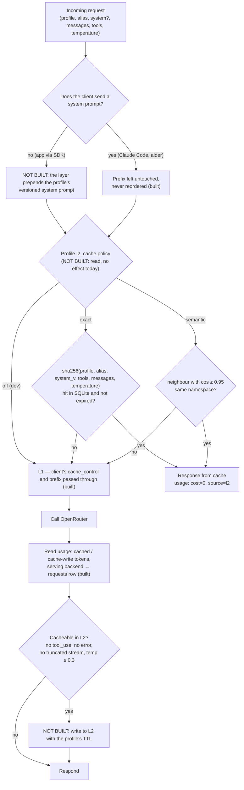

# Cache logic: what the proxy does, and the L2 design

The layers themselves (L0–L3) and the measured findings are in
[Cache layers](./cache.md). This page is the request flow: what is built
today, and the pieces designed but not built.

## What is built (Phase 1)

- **L1 pass-through.** The prefix is never reordered or rewritten; the
  client's `cache_control` blocks reach the provider untouched (tested in
  `proxy/sanitize.rs`). For the OpenAI dialect the proxy adds
  `usage.include` so every response reports its cached tokens.
- **Measurement.** Every request row stores cache-read and cache-write
  tokens, cost and the serving backend; the board turns them into the
  **Providers** and **Prompt cache** sections ([Cache layers](./cache.md#what-the-board-shows-from-v032)).
- **Nothing else.** No `cache_control` insertion, no `session_id`, no
  server-side system prompt (`config/prompts/` is empty), no L2.

## The client that doesn't cache

Claude Code and aider have their own L0 and send a stable prefix. **Apps
via SDK are the main "no client cache" case**: they send the entire
prompt on every request. Two problems, two answers:

1. **The prefix repeats** (instructions, output schema, examples): the
   provider cache pays off **only if the prefix is byte-identical and at
   the start**. An app that puts the date or user id in its system prompt
   breaks the cache on every call. Today's answer is app-side discipline
   (static prefix first, variable data after). *Not built:* the layer
   keeping a versioned system prompt per profile and prepending it, so
   the app sends only the variable data.
2. **The same question comes back** (assistant FAQ, same listing
   reclassified): no provider knows. → **L2 in the layer** (not built),
   below.

## The decision flow

{/* diagram: 07-cache-decision */}

Fixed rules (the built ones hold today, the rest bind L2 when it exists):

- **Never reorder the prefix**: system, tools, skills first; variable
  content after. One moved line invalidates everything.
- **For Claude Code (`dev`) the layer never touches `system`**: the
  attribution block must stay first and intact; a server-side system
  prompt would be for apps only ([details](./client-compatibility.md)).
- **L2 always off for `dev`**: files change between requests.
- **Don't cache in L2**: responses with `tool_use`, errors, truncated
  streams, requests with `temperature` > 0.3 (unless an explicit policy).
- **Always record cached tokens** per request: without them you don't
  know whether the cache works (built).

## L2 response cache: design (not built)

:::note Not built yet (Phase 2)
`l2_cache: off | exact` is read from `profiles.yaml` and has no effect.
:::

- **Exact** (`assistant`, `car`): a table in the same SQLite file, key =
  sha256 of the normalized request (profile, alias, system version,
  tools, messages, temperature), TTL per profile, response replayed with
  `cost = 0` and marked as an L2 hit on the board. ~100 lines of Rust, no
  new dependency.
- **Semantic** (`assistant` only, later): `sqlite-vec` in the same file +
  cheap embeddings, threshold cos ≥ 0.95, namespace = system prompt
  version. It pays only if embedding cost ≪ saved response cost; for
  listing classification an exact match on the listing id (L3, app side)
  is simpler and safer.

Rejected: Redis (one more service, not needed for one user), GPTCache and
LiteLLM's cache (Python dependencies, out of the stack), Helicone /
Portkey (one more hop, prompts leave to third parties).

## What to measure

- `cache read / prompt tokens` per profile, model and backend, and cold
  turns per day — on the board today. The board flags the 7-day share
  below 92 % and alarms below 80 %.
- L2 hit rate and cost avoided, per profile — once L2 exists.
