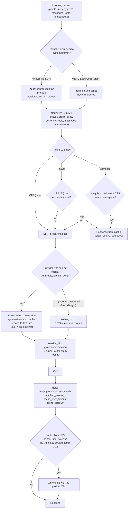

# Cache logic: how it works and with which software

Question: *"what software could I use? was the case where the client does
no caching considered?"* Short answer: **the "client with no cache" case
is the apps' case, and it is the main one**. Claude Code and aider have
their own L0; apps via SDK send everything every time. For them all the
logic lives in the layer.

## What happens without a client that caches

An app sends the entire prompt on every request. Two problems and two
answers:

1. **The prefix repeats** (instructions, output schema, examples): if the
   provider has a prompt cache, you pay 0.1×–0.5× **only if the prefix is
   byte-identical and at the start**. An app that composes the system
   prompt with f-strings and puts the date/time or user id in it breaks
   the cache on every call. → The layer **keeps the system prompt per
   profile**, versioned, and prepends it itself: the app sends only the
   variable data.
2. **The same question comes back** (assistant FAQ, same listing
   reclassified): no provider knows. → **L2 in the layer**, exact or
   semantic, per profile.

## The decision flow

{/* diagram: 07-cache-decision */}

Fixed rules:

- **Never reorder the prefix**: system, tools, skills first; variable
  content after. One moved line invalidates everything.
- **For Claude Code (`dev` profile) the layer doesn't touch `system`**: the
  attribution block must stay first and intact; server-side system
  prompt prepending applies to apps only ([details](./client-compatibility.md)).
- **Don't cache in L2**: responses with `tool_use`, errors, truncated
  streams, requests with `temperature` > 0.3 (unless an explicit policy).
- **L2 always OFF for `dev`**: files change between requests.
- **Always** read `prompt_tokens_details` and save `cached_tokens` and
  `cache_discount` in usage: without this you don't know whether the
  cache works.

## L1 — Prompt cache through OpenRouter (verified 2026-09-19)

| Provider | Mode | Write | Read |
|----------|------|-------|------|
| OpenAI, DeepSeek, Grok, Groq, Moonshot, Z.AI, Gemini 2.5 | **automatic** (prefix) | 1× (OpenAI 1.25×) | 0.1×–0.5× |
| Anthropic | explicit: `cache_control` per block | 1.25× (5 min) / 2× (1 h) | 0.1× |
| Gemini (explicit), Qwen | explicit: `cache_control` | 1.25× | 0.1×–0.25× |

- Hits reported in `usage.prompt_tokens_details.cached_tokens`,
  `cache_write_tokens`, `cache_discount` (negative on writes).
- **Sticky routing**: after a hit OpenRouter sends subsequent requests to
  the same endpoint; controllable with `session_id` (expires after 10
  min). The layer sets it to `profile+conversation`.
- **Open models on third-party providers (e.g. bonsai on Darkbloom): not
  documented.** To measure in Phase 0 with `cached_tokens`: if it's
  always 0, that model has no L1 and the real cost is the full one.

Software: **nothing to install**. It's the provider. The layer's job is a
stable prefix + inserting `cache_control` where needed + `session_id`.
agent-orchestrator's `providers/openrouter.py` already injects
`cache_control` for the CLI's `cache_context`: that's the piece to
extend.

## L2 — Response cache: the options

| Option | Type | Pros | Cons |
|--------|------|------|------|
| **SQLite in llm_brain** (extend `core/cache.py`, InMemory today) | exact | ~100 lines, zero dependencies, key = normalized hash, TTL per profile | exact only |
| Redis | exact | shared across processes, native TTL | one more service; not needed for a single user |
| **GPTCache** (Python library) | semantic | pluggable: embedding + vector store + eviction policy | heavy dependency, not very active |
| LiteLLM cache (in-memory / redis / redis-semantic) | exact + semantic | ready if you use LiteLLM | LiteLLM is out of Phase 0 |
| Helicone / Portkey | exact via header | zero code | external proxy: one more hop and prompts leave to third parties |
| **sqlite-vec + embeddings** | semantic | light, in-process, same SQLite file | to write: ~200 lines |

For the semantic cache the embedding has a cost: it only pays if
embedding cost ≪ saved response cost. With a cheap embedding model via
OpenRouter or local (`sentence-transformers`, CPU) the math works for the
assistant; for listing classification, exact match by `listing id` (L3,
app side) is simpler and safer.

## Recommendation

| Layer | Phase | Choice |
|-------|-------|--------|
| L1 | 0 | OpenRouter, measuring `cached_tokens` for every candidate model |
| L1 | 1 | server-side system prompt per profile + `cache_control` + `session_id` |
| L2 exact | 1 | SQLite, extending `core/cache.py` with a persistent backend and a key from the normalized request; ON for `assistant`, `car`; OFF for `dev` |
| L2 semantic | 2, `assistant` only | `sqlite-vec` + cheap embeddings; threshold 0.95; namespace = system prompt version |
| External proxies | — | no: one more hop and data leaves |

## What to measure to know it works

- `cached_tokens / prompt_tokens` per profile and per model (target for
  `dev`: > 60% with Claude Code, whose system prompt is large).
- L2 hit rate for `assistant` (`core/cache.py` already has
  `CacheStats.hit_rate`).
- € saved = summed `cache_discount` + cost avoided by L2 hits.
All three go in the dashboard next to the budget.
