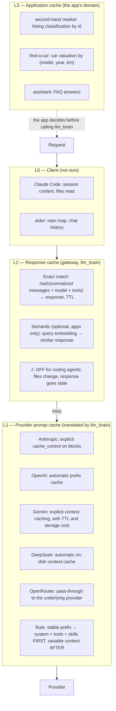

# The cache layers: what they are and who owns them

Key point: **not all caches are ours**, and they must be treated
differently. This page says *what* the layers are; the decision flow, the
case of clients with no cache, and the software options are in
[Cache logic and software](./cache-logic.md).

{/* diagram: 03-cache-layers */}

## L0 — Client

We don't touch it. Claude Code and aider manage what to keep in session
on their own.

## L1 — Provider prompt cache

The cache that **really saves money** in coding agents: system prompt +
tools + skills (tens of KB) repeat identically every turn. Every provider
does it its own way:

| Provider | Mechanism |
|----------|-----------|
| Anthropic | explicit `cache_control` on blocks |
| OpenAI | automatic prefix cache |
| DeepSeek | automatic on-disk context cache |
| Gemini | explicit context caching, with TTL and storage cost |
| OpenRouter | pass-through to the underlying provider (to verify per model) |
| Local (vLLM / llama.cpp) | prefix cache / KV cache: `none` strategy on the layer side |

The translator must: accept hints in both dialects, translate or drop
them, **never reorder the prefix** (system, tools, skills first; variable
content after), and report cache hits in usage. If this piece is wrong,
Claude Code behind the proxy costs double.

## L2 — Gateway response cache

Useful for apps (assistant FAQs, repeated classifications), **harmful for
coding** (files change between requests, the cached answer is stale). Per
profile:

| Profile | L2 |
|---------|----|
| `dev` | OFF |
| `assistant` | exact match ON |
| `market` | semantic ON |
| `car` | exact match ON |

## L3 — Application

The app's domain, not the layer's (listing classification by id, car
valuation by model/year/km, FAQ). The layer can expose a helper (suggested
cache key) so it isn't reinvented.
