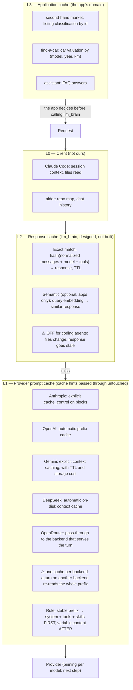

# The cache layers: what they are and who owns them

Key point: **not all caches are ours**, and they must be treated
differently. This page owns the layer model and what has been measured;
the request flow, what is built and the L2 design are in
[Cache logic](./cache-logic.md).

| Layer | Owner | Status |
|-------|-------|--------|
| L0 client session | Claude Code, aider | not ours |
| L1 provider prompt cache | the backend that serves the turn | **the one that saves money**; the proxy passes it through and measures it |
| L2 response cache | llm_brain | **not built** (`l2_cache:` in `profiles.yaml` is read, nothing caches) |
| L3 application cache | each app | the app's domain |

{/* diagram: 03-cache-layers */}

## L0 — Client

We don't touch it. Claude Code and aider manage what to keep in session
on their own.

## L1 — Provider prompt cache

The cache that **really saves money** in coding agents: system prompt +
tools + skills (tens of KB) and the growing history repeat identically
every turn. Verified through OpenRouter on 2026-09-19:

| Provider | Mode | Write | Read |
|----------|------|-------|------|
| OpenAI, DeepSeek, Grok, Groq, Moonshot, Z.AI, Gemini 2.5 | **automatic** (prefix) | 1× (OpenAI 1.25×) | 0.1×–0.5× |
| Anthropic | explicit `cache_control` per block | 1.25× (5 min) / 2× (1 h) | 0.1× |
| Gemini (explicit), Qwen | explicit `cache_control` | 1.25× | 0.1×–0.25× |
| Local (vLLM / llama.cpp) | prefix / KV cache, nothing to do on the layer side | — | — |

On the tiers in use: `deepseek-v4-pro` and `v4-flash` cache
automatically (a read costs about a tenth of full price); `bonsai-2-27b`
has no prompt cache, one of the reasons it is not the daily driver.

What the proxy does: it **never reorders or rewrites the prefix** —
Claude Code's `cache_control` blocks pass through untouched — and it
records cache-read and cache-write tokens plus the serving backend on
every request row. It does not add `cache_control` or a `session_id` of
its own (see [Cache logic](./cache-logic.md)).

### Which backend serves the turn (2026-09-22)

OpenRouter is not one cache. A model is served by many endpoints —
`deepseek-v4-pro` has 16 — and **the prompt cache lives in the backend
that served the turn**, so a turn that lands somewhere the prefix has
never been pays the whole history at full price.

Measured on one live `px-claude` session (dev, 203 requests, $2.44):

| turn | input | cache read | cost |
|------|-------|------------|------|
| warm | ~2.000 | ~114.000 | **$0.011** |
| cold | ~112.000 | 0 | **$0.102** |

Ten of its last 28 turns were cold — **~$0.91 in ten minutes** — and warm
and cold alternate within seconds on a prefix that only grows, which is
what a turn changing backend looks like rather than a TTL expiring. Two
identical probe requests confirmed it directly: `StreamLake`, then
`SiliconFlow`.

OpenRouter names the backend in `provider`: at the top level of a
non-streamed body and of an OpenAI chunk, and inside `message` in an
Anthropic `message_start`. The proxy reads it in both dialects, streamed
or not, and stores it on the request row.

**Pinning is the next step, not yet done**: `provider.order` plus
`allow_fallbacks` in the upstream body. Price is a second reason to
choose: across those 16 endpoints input runs from $0.919 to $1.91 per M
and cache reads from $0.0766 to $0.33 per M.

### What the board shows (from v0.3.2)

**Providers** lists who served each model, with the share of turns that
reused the cache. **Prompt cache** turns it into money, per UTC day:
requests, **cold turns** — a prompt of at least 5000 tokens that read
*nothing* from cache, which is a prefix paid again rather than a new
conversation — the share of prompt tokens served from cache, and an
estimate of what those re-reads cost above the warm price: nine tenths of
what those turns were actually billed. It comes from recorded cost, not
from catalog prices, which move.

First 45 minutes after the cutover (2026-09-22T17:24Z):

| model | backends | requests | prompt from cache | full price |
|-------|----------|----------|-------------------|------------|
| `deepseek-v4-pro` | 1 (StreamLake) | 9 | **100 %** | 0 |
| `deepseek-v4-flash` | 4 (Baidu, StreamLake, OpenInference, DigitalOcean) | 47 | **69.6 %** | 1.13M tokens |

So the fragmentation is **between providers**, at least on the model that
scatters, which is what `provider.order` fixes. That `v4-pro` stayed on one
backend for 45 minutes does not clear it — the cold turns measured the day
before were on `v4-pro`, so the scatter is intermittent there and the pin is
worth having on both.

One caveat on that `v4-flash` row: at 17:54Z the `dev` profile crossed 70 %
of its daily budget and the ring forced every request to the `fast` tier
([budget](./budget.md)), so a live session's ~110k-token prefix moved from
`v4-pro` to `v4-flash` and started cold there. Its 69.6 % therefore mixes
backend fragmentation with one forced tier migration. What the migration
does *not* explain is the count: four backends for one model, which is the
part pinning addresses.

## L2 — Gateway response cache (not built)

Useful for apps (assistant FAQs, repeated classifications), **harmful for
coding** (files change between requests, the cached answer is stale).
Policy per profile, already in `profiles.yaml` but without effect until L2
exists:

| Profile | `l2_cache` |
|---------|-----------|
| `dev`, `ago`, `benchmark` | `off` |
| `assistant`, `car` | `exact` |
| `market` (later) | semantic, planned |

Design and software choice: [Cache logic](./cache-logic.md#l2-response-cache-design-not-built).

## L3 — Application

The app's domain, not the layer's (listing classification by id, car
valuation by model/year/km, FAQ): exact match on a domain key in the app
is simpler and safer than anything the layer could guess.
