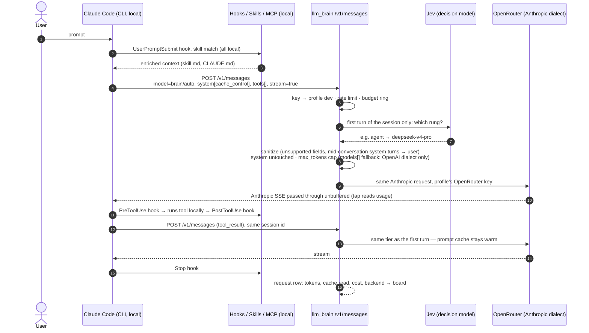

# How Claude Code and aider react

Question: *"do skills and hooks always work?"* Answer: **yes, they are
client-side**. What can degrade is the model behind, not the client.

Roles today: **Claude Code through the proxy (`px-claude`) is the daily
agent**; aider is the cheap editor for targeted changes; OpenCode is
benchmarked as a third tool ([Phase 1](../phase-1.md#agents-compared-through-the-proxy)).

{/* diagram: 02-request-flow-claude-code */}

## Claude Code with `ANTHROPIC_BASE_URL` → llm_brain

`brain setup claude-code --proxy` prints the `px-claude` shell function
(`--docker` for the containerised variant): `ANTHROPIC_BASE_URL` = the
proxy, `ANTHROPIC_AUTH_TOKEN` = the `dev` client key, main model
`brain/auto` ([Auto routing](./auto-routing.md)), background ("haiku")
model `brain/fast`, experimental betas and adaptive thinking disabled.
Plain `claude` keeps the Anthropic subscription. Pin a tier with
`ANTHROPIC_MODEL=brain/agent px-claude` or `/model brain/agent`.

### Always works (runs locally in the CLI)

| Feature | Why |
|---------|-----|
| Hooks (`PreToolUse`, `PostToolUse`, `Stop`, `UserPromptSubmit`…) | Shell scripts executed by the CLI |
| Skills | Markdown injected into the context: reaches the model as text |
| CLAUDE.md, slash commands, permissions | Client-side |
| MCP servers | Tools run locally; only the schema reaches the model |
| Subagents | Just more HTTP requests |
| [claude-kit](https://github.com/pjcau/claude-kit) (submodule `.claude-kit/`) | Portable hooks/skills/agents: no impact, reused as-is |

### What the proxy has to get right

SSE passed through unbuffered, `count_tokens` forwarded, `claude-*` ids
mapped to a tier, `anthropic-beta` / `anthropic-version` passed on, and
the sanitizer: drop `context_management`, `output_config` and adaptive
`thinking`, turn Claude Code's mid-conversation `system` turns into user
turns (without it non-Claude models answer with an empty reply). Details
and reasons: [Client compatibility](./client-compatibility.md).

### Degrades with the model behind (doesn't break, gets worse)

- **Tool-call reliability**: weak models produce malformed tool calls →
  retries → more tokens → more cost. The `agent` tier
  (`deepseek-v4-pro`) exists for this: it is the tier with a measured
  reliable Claude Code loop, and `brain/auto`'s fallback.
- **Skill adherence**: long prompts; a weak model partly ignores them.
- **Extended thinking**: only if the model behind has reasoning.
- **Context**: the limit is the model's behind (1M on the current tiers).
- **Prompt caching**: Claude Code leans on it heavily; a turn on a new
  backend re-reads the whole history ([Cache layers](./cache.md)).

## aider with `OPENAI_API_BASE` → llm_brain

- `brain setup aider --proxy` prints `px-aider`: architect
  `brain/reasoning`, editor `brain/fast`, auto-commits, the repo's
  `CLAUDE.md` read as conventions. It is for **targeted changes**, not
  the agent loop.
- `brain setup aider` also writes `.aider.model.metadata.json` (context
  and prices of the aliases, otherwise aider misestimates) and the model
  settings: `diff` / `editor-diff` edit formats (aider defaults unknown
  models to `whole`, expensive and fragile) and the tier's OpenRouter
  fallback chain.
- No hooks or skills: the equivalents are `--read`, `--lint-cmd`,
  `--test-cmd`, `--auto-test`. `--auto-test` is the natural signal for
  escalation, which is not built yet ([API layer](./api-layer.md#escalation)).
