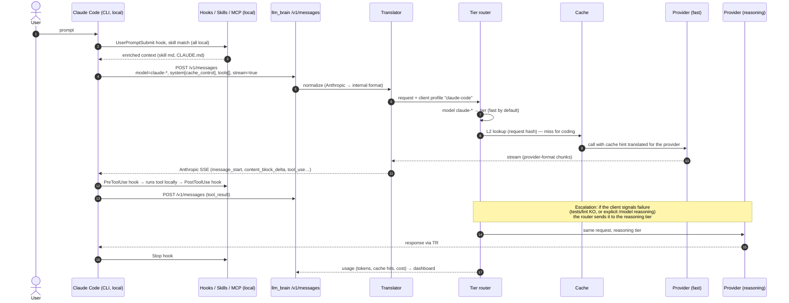

# How Claude Code and aider react

Question: *"do skills and hooks always work?"* Answer: **yes, they are
client-side**. What can degrade is something else.

{/* diagram: 02-request-flow-claude-code */}

## Claude Code with `ANTHROPIC_BASE_URL` → llm_brain

### Always works (runs locally in the CLI)

| Feature | Why |
|---------|-----|
| Hooks (`PreToolUse`, `PostToolUse`, `Stop`, `UserPromptSubmit`…) | Shell scripts executed by the CLI |
| Skills | Markdown injected into the context: reaches the model as text |
| CLAUDE.md, slash commands, permissions | Client-side |
| MCP servers | Tools run locally; only the schema reaches the model |
| Subagents | Just more HTTP requests |
| [claude-kit](https://github.com/pjcau/claude-kit) | Portable hooks/skills: no impact |

### Depends on the translator (if wrong, it breaks)

SSE streaming, `tool_use`/`tool_result`, `cache_control`, `thinking`,
`count_tokens`, beta headers, `claude-*` mapping. Full list in
[API layer](./api-layer.md#translator-the-main-technical-risk-deferred).

### Degrades with the model behind (doesn't break, gets worse)

- **Skill adherence**: long prompts; a weak model partly ignores them.
  This is the real risk of "90% on fast".
- **Tool-call reliability**: weak models produce malformed tool calls →
  retries → more tokens → more cost. To measure in Phase 0.
- **Extended thinking**: only if the model behind has reasoning.
- **Context**: the limit is the model's behind, not 1M.
- **Prompt caching**: Claude Code leans on it heavily ([L1 cache](./cache.md)).

## aider with `OPENAI_API_BASE` → llm_brain

- No concept of hooks or skills. Equivalents: `.aider.conf.yml`,
  `--read CONVENTIONS.md`, `--lint-cmd`, `--test-cmd`, `--auto-test`.
- **`--auto-test` is the natural hook for escalation**
  ([details](./api-layer.md#escalation)).
- It uses LiteLLM internally: any `openai/<alias>` works; the
  `brain/fast`, `brain/reasoning` aliases from `/v1/models` are picked
  with `/model`.
- `.aider.model.metadata.json` is needed to tell aider the aliases'
  context and cost, otherwise it misestimates.
- The edit format (`diff`, `whole`, `udiff`) matters a lot for weak
  models: to try for every model in the `fast` tier.
