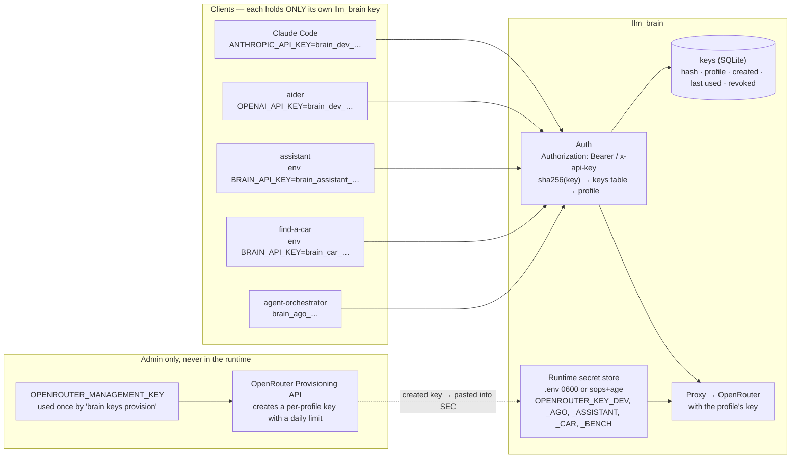

# Secrets management

Problem: llm_brain will be used by several applications. There are **two
families of secrets** with different owners, and the design must guarantee
that no client ever sees the OpenRouter keys.

{/* diagram: 08-secrets-flow */}

## The two families

| Family | Owner | Where it lives | If it leaks |
|--------|-------|----------------|-------------|
| **Upstream keys** (OpenRouter, one per profile) | llm_brain only | the server's secret store | spend **up to that key's daily limit**, no more |
| **Client keys** (`brain_<profile>_<random>`, one per app/tool) | the app or tool | the app's env; in llm_brain only the **hash** | spend up to **that profile's** budget; revoked without touching other apps |
| OpenRouter **management key** (Provisioning API) | admin | never on the server at runtime | can create keys and raise limits: the most sensitive |

The blast radius is bounded by construction: one key per profile on the
OpenRouter side **and** one per profile on the client side. Same reason
the [budget](./budget.md) is per profile.

## Client keys: lifecycle

- Format `brain_<profile>_<32 random bytes base64url>`: the prefix makes
  *which* profile readable in logs without revealing the key.
- Stored in SQLite as `sha256(key)` (high-entropy token: sha256 is enough,
  no argon2). Shown **once** at creation.
- `keys` table: `hash`, `profile`, `name`, `created_at`, `last_used_at`,
  `revoked_at`.
- Accepted in both headers: `Authorization: Bearer` (OpenAI SDK, aider)
  and `x-api-key` (Anthropic SDK, Claude Code).
- Commands: `brain keys create --profile assistant --name prod`,
  `brain keys list`, `brain keys revoke <name>` — details and sequence in
  [Authentication flow](./auth-flow.md).
- **Rotation** = create new → replace in the app → revoke old; the two
  coexist meanwhile.

## Upstream keys: where they live

| Option | When |
|--------|------|
| **`.env` with 0600 permissions**, loaded at startup, never committed | local, single user: the starting choice |
| **sops + age** (committable encrypted YAML) | if profile config must live in the repo, or llm_brain runs on a second machine |
| `pass` / 1Password CLI | if you want the keys in your password manager, injected at startup |
| Vault / Doppler / Infisical | no: overkill for a single-user service |

Rules:
- **No secret in `tiers.yaml` / `profiles.yaml`**: config references
  variable names (`openrouter_key_env: OPENROUTER_KEY_DEV`), not values.
- The management key lives only in the admin's shell for as long as it
  takes to run `brain keys provision` (creates the per-profile OpenRouter
  keys with `limit` and `limit_reset: daily`, prints the result to paste
  into the store).
- Logs: keys always redacted (`brain_dev_…a1b2`); **prompts not logged in
  full by default** (the apps' data is the apps' users' data).

## How each client receives it

| Client | Variables |
|--------|-----------|
| Claude Code | `ANTHROPIC_BASE_URL=https://<brain>/` `ANTHROPIC_API_KEY=brain_dev_…` (in `settings.json` env or the shell) |
| aider | `OPENAI_API_BASE=https://<brain>/v1` `OPENAI_API_KEY=brain_dev_…` (uncommitted `.aider.conf.yml` or env) |
| assistant, find-a-car | `BRAIN_BASE_URL`, `BRAIN_API_KEY` in the deploy env (docker compose `.env`, platform secret) |
| agent-orchestrator | `providers/openai.py` with `base_url` and key `brain_ago_…` |
| benchmark | key `brain_bench_…` read by the runner |

## The question that decides the rest: where does llm_brain run?

Updated context and the decision (llm_brain on the VPS) in
[Authentication, topology and persistence](./auth-topology.md). The
options in short:

| Option | Pros | Cons |
|--------|------|------|
| **Tailscale** (private network) | zero open ports, TLS included, 10-minute setup | the apps must be able to join the tailnet (fine on a VPS, not on Vercel/serverless) |
| Cloudflare Tunnel | reachable from anywhere, TLS, no open ports | public endpoint: key auth becomes the only defence → add per-key rate limit and IP allowlist |
| llm_brain on the same VPS as the apps | minimal latency, no tunnel | the secret store is on a remote machine: sops+age mandatory |
| Everything local | no problem | only if the apps run at home |

Until the decision was taken, llm_brain listened only on `127.0.0.1`.

## How the CLI handles secrets (Phase 0, verified in code)

| Command | Behaviour |
|---------|-----------|
| `brain keys provision` | reads the management key from the env for that call only; prints the new keys **once** as `.env` lines; stores nothing |
| `brain usage`, `brain serve` | read `OPENROUTER_KEY_*` from the env, send them only as `Bearer` to OpenRouter; SQLite holds numbers, logs hold counts |
| `brain setup …` | prints `"$OPENROUTER_KEY_DEV"` as a variable reference, never a value |
| `brain events ingest` | stores at most 200 chars of error text from the tools' logs; no keys appear there |
| `brain bench --docker` | passes `-e NAME` (no value) to `docker run`, so the key is inherited from the process env and never shows in `ps` |
| board `/api/summary` | spend, models, runs — no keys; basic auth in front on the VPS |

Trade-off to know: sourcing `.env` in `~/.bashrc` puts the keys in every
shell's environment, readable by any process you run as your user. That is
the usual laptop compromise; the stricter alternative is `apiKeyHelper` /
`pass` per tool.

## Things we don't do

- No OpenRouter key in a client, ever, not even "to try".
- No key shared between profiles: a compromised app doesn't touch the
  others.
- No plaintext secret in YAML, in Docusaurus, in logs, in commits.
