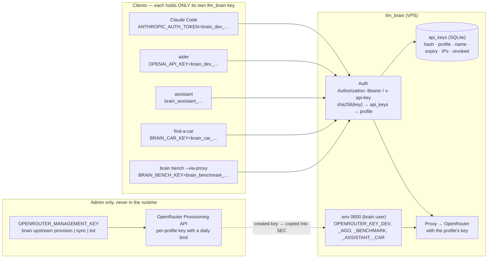

# Secrets management

llm_brain serves several clients. There are **two families of secrets**
with different owners, and no client ever sees an OpenRouter key.

{/* diagram: 08-secrets-flow */}

## The two families

| Family | Owner | Where it lives | If it leaks |
|--------|-------|----------------|-------------|
| **Upstream keys** (OpenRouter, one per profile: `OPENROUTER_KEY_<PROFILE>`) | llm_brain only | `.env` 0600 on the VPS | spend **up to that key's daily limit**, no more |
| **Client keys** (`brain_<profile>_<random>`, one per app/tool) | the app or tool | the app's env; in llm_brain only the **hash** | spend up to **that profile's** budget; revoked without touching other apps |
| OpenRouter **management key** (Provisioning API) | admin | the password manager; in `.env` only for one `brain upstream` call | can create keys and raise limits: the most sensitive |

The blast radius is bounded by construction: one key per profile on the
OpenRouter side **and** one per profile on the client side. Same reason
the [budget](./budget.md) is per profile.

## Client keys

- Format `brain_<profile>_<32 random bytes base64url>`: the prefix makes
  *which* profile readable in logs without revealing the key.
- Stored in SQLite (`api_keys`) as `sha256(key)` (high-entropy token:
  sha256 is enough, no argon2) plus a display prefix `brain_dev_…a1b2`.
  Shown **once** at creation.
- Accepted in both headers: `Authorization: Bearer` and `x-api-key`.
- `brain keys create --profile assistant --name prod`, `brain keys list`,
  `brain keys revoke --profile assistant --name prod` — table, checks and
  sequence in [Authentication flow](./auth-flow.md).
- **Rotation** = create new → replace in the app → revoke old; the two
  coexist meanwhile.

## Upstream keys

- `.env` with 0600 permissions, never committed: on the VPS
  `/opt/llm_brain/.env` (owner `brain`, loaded by systemd), locally the
  repo's `.env` (`.env.example` lists the names). sops+age, `pass` or
  Vault add nothing for one admin and one server.
- **No secret in `tiers.yaml` / `profiles.yaml`**: a profile's key is read
  from `OPENROUTER_KEY_<PROFILE>` by convention (`dev` →
  `OPENROUTER_KEY_DEV`).
- `brain upstream provision` creates the per-profile keys with `limit`
  and `limit_reset: daily` from `profiles.yaml` and prints them once as
  `.env` lines; `brain upstream sync` aligns the limits of existing keys
  (the secret doesn't change); `--force --only <profile>` rotates one.
  The management key is in `.env` only for that call, then removed.
- Logs: keys always redacted; **prompts are not stored** (the `requests`
  table holds counts, costs and ids, never content).

## Environment variables

| Variable | Secret | Read by |
|----------|--------|---------|
| `OPENROUTER_KEY_DEV`, `_AGO`, `_BENCHMARK`, `_ASSISTANT`, `_CAR` | yes | `brain serve` (proxy upstream), `usage snapshot`, `bench run` (direct), `setup` (as a reference) |
| `OPENROUTER_MANAGEMENT_KEY` | yes, the most sensitive | `brain upstream provision\|sync\|list` only |
| `BRAIN_BENCH_KEY` | yes (client key, `benchmark` profile) | `brain bench run --via-proxy` |
| `BRAIN_BASE_URL`, `BRAIN_DEV_KEY` | the key, yes | `px-claude` / `px-aider`, from the git-ignored `deploy/server.local.env` |
| `BRAIN_HOME`, `BRAIN_DB`, `BRAIN_DATA` | no | repo/config dir, SQLite file, tool logs dir |
| `BRAIN_CLAUDE_PROJECTS`, `BRAIN_AIDER_ROOTS` | no | extra log locations for `events ingest` |

## How each client receives its key

| Client | Variables |
|--------|-----------|
| Claude Code | `px-claude`: `ANTHROPIC_BASE_URL=$BRAIN_BASE_URL`, `ANTHROPIC_AUTH_TOKEN=$BRAIN_DEV_KEY` |
| aider | `px-aider`: `OPENAI_API_BASE=$BRAIN_BASE_URL/v1`, `OPENAI_API_KEY=$BRAIN_DEV_KEY` |
| find-a-car | `BRAIN_BASE_URL`, `BRAIN_CAR_KEY` in the app's git-ignored `.env` |
| assistant | its `brain_assistant_…` key in the app's env |
| benchmark | `BRAIN_BENCH_KEY` (via proxy) or `OPENROUTER_KEY_BENCHMARK` (direct) |
| agent-orchestrator | not wired yet (`ago` profile ready) |

Where llm_brain runs and how it is exposed: [Authentication, topology and
persistence](./auth-topology.md).

## How the CLI handles secrets (verified in code)

| Command | Behaviour |
|---------|-----------|
| `brain upstream provision` | reads the management key from the env for that call only; prints the new keys **once** as `.env` lines; stores nothing |
| `brain serve` (proxy) | holds `OPENROUTER_KEY_*` in memory and sends them only as `Bearer` to OpenRouter; client keys are compared by hash; responses never carry the upstream key (tested) |
| `brain usage` | sends `OPENROUTER_KEY_*` only to OpenRouter's `GET /key`; SQLite holds numbers |
| `brain setup …` | prints `"$OPENROUTER_KEY_DEV"` / `"$BRAIN_DEV_KEY"` as variable references, never values |
| `brain events ingest` | stores at most 200 chars of error text from the tools' logs; no keys appear there |
| `brain bench --docker` | passes `-e NAME` (no value) to `docker run`, so the key is inherited from the process env and never shows in `ps` |
| board `/api/summary` | spend, models, runs — no keys; basic auth in front on the VPS |

Trade-off to know: sourcing `.env` in `~/.bashrc` puts the keys in every
shell's environment, readable by any process you run as your user. That is
the usual laptop compromise; the stricter alternative is `apiKeyHelper` /
`pass` per tool.

## Things we don't do

- No OpenRouter key in a client, ever, not even "to try".
- No key shared between profiles: a compromised app doesn't touch the
  others.
- No plaintext secret in YAML, in Docusaurus, in logs, in commits.
