# Diagrams

Mermaid sources in `diagrams/*.mmd`. After editing a source:
`npm run sync-diagrams` updates every embedded copy in the pages.

## 1. System

{/* diagram: 01-system-overview */}
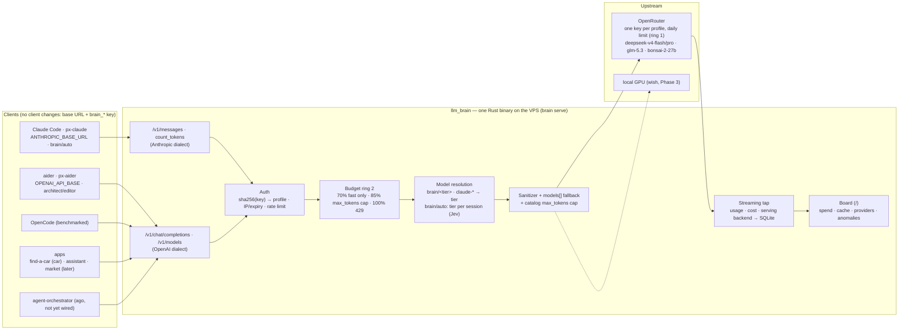

## 2. Flow of a request from Claude Code (hooks and skills)

{/* diagram: 02-request-flow-claude-code */}
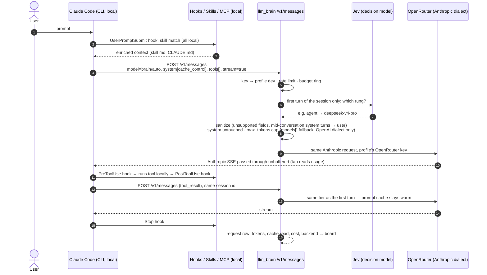

## 3. Cache layers

{/* diagram: 03-cache-layers */}
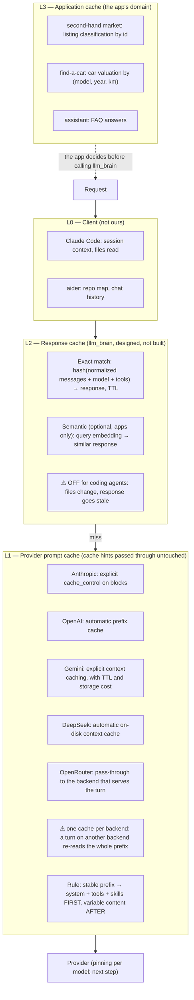

## 4. App integration

{/* diagram: 04-app-integration */}
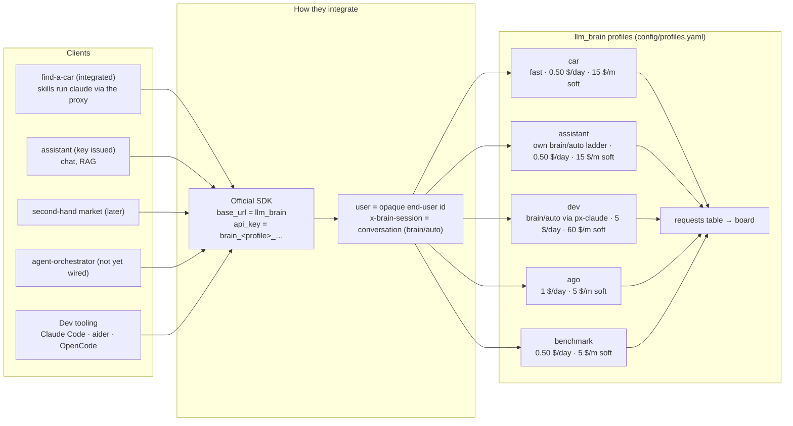

## 5. Modules: what agent-orchestrator inspired, what exists

{/* diagram: 05-agent-orchestrator-modules */}
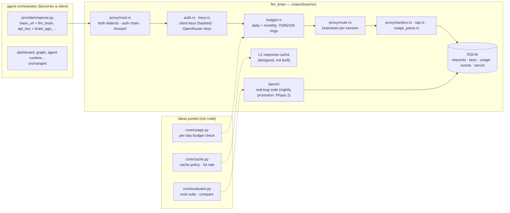

## 6. Budget rings

{/* diagram: 06-budget-rings */}
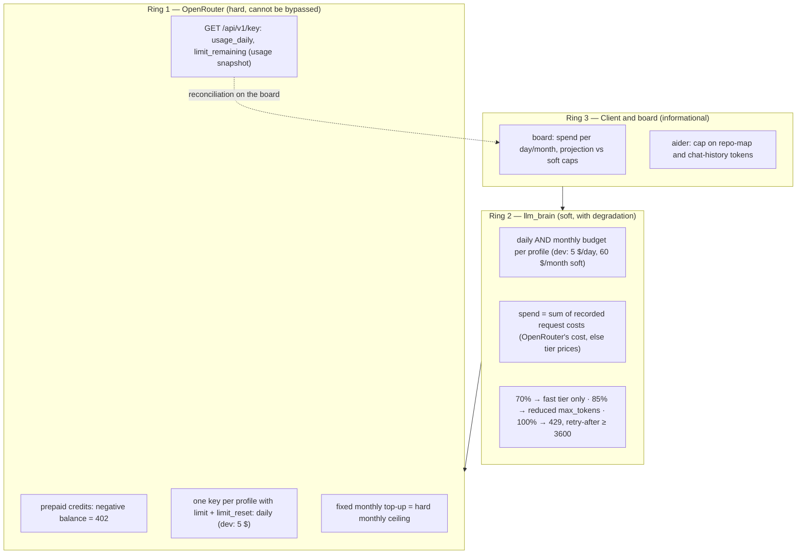

## 7. Cache decision flow (L2 steps designed, not built)

{/* diagram: 07-cache-decision */}
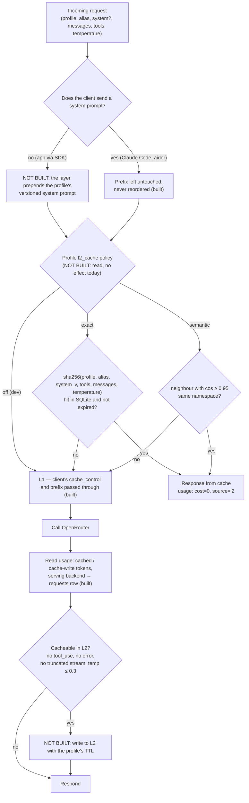

## 8. Secrets flow

{/* diagram: 08-secrets-flow */}
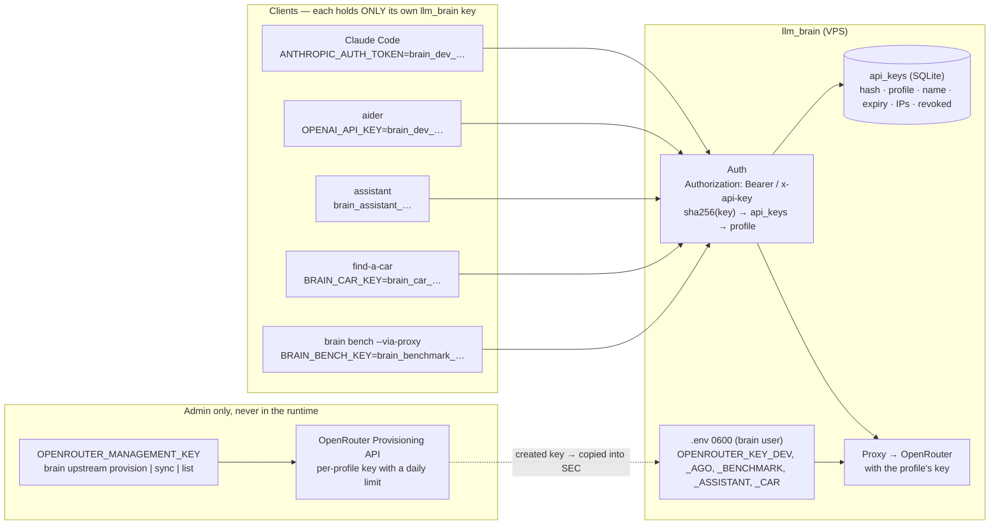

## 9. Topology

{/* diagram: 09-topology */}
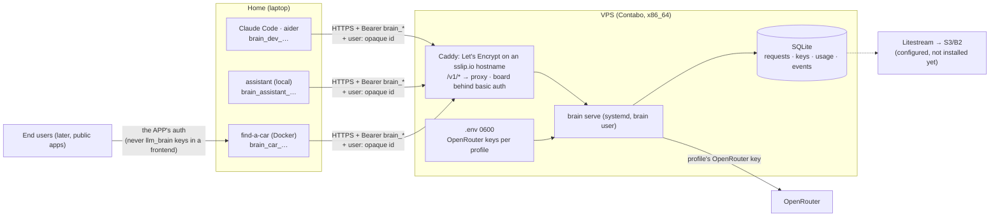

## 10. Authentication sequence

{/* diagram: 10-auth-sequence */}
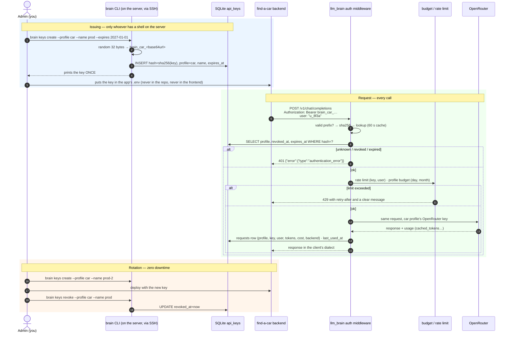

## 11. Hosting: what runs, what is equivalent

{/* diagram: 11-hosting-options */}
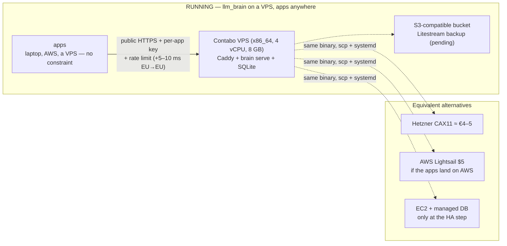

## 12. Auto routing (brain/auto)

{/* diagram: 12-auto-routing */}
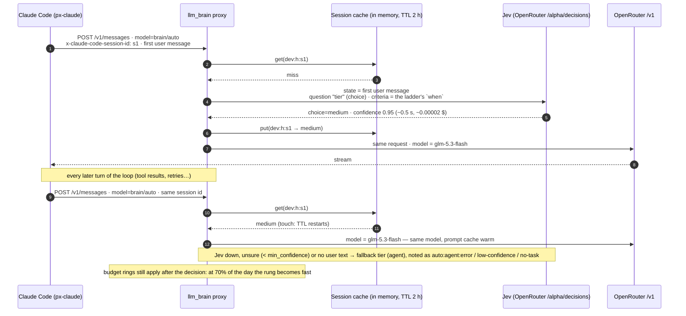
