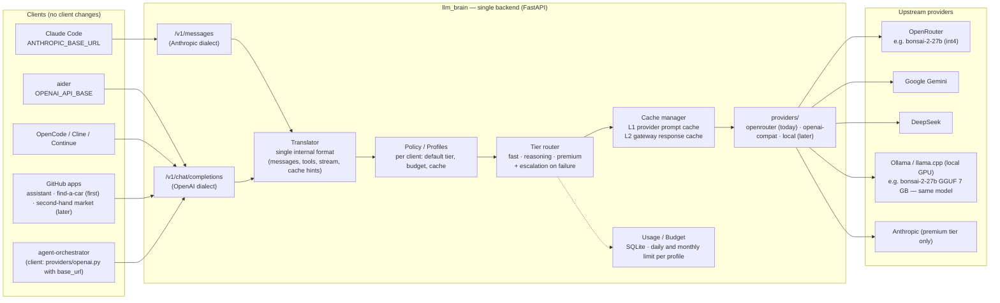

# llm_brain — Overview

The general document, deliberately short. Every point links to a page with
the full reasoning. Updated at every iteration: see the
[changelog](./changelog.md).

## What we want

1. **Replace the Claude subscription** with a CLI workflow (Claude Code
   style) on cheap models, indicative budget **< 40 €/month**, 90/10 split
   between a fast model and a reasoning model → [Costs and the 90/10 plan](./analysis/costs-90-10.md)
2. **A reusable API layer** that exposes the two standard dialects
   (`/v1/messages` Anthropic, `/v1/chat/completions` OpenAI) and hides
   providers, models and caches → [API layer](./architecture/api-layer.md)
3. **A single, standalone backend** that centralizes every LLM request;
   agent-orchestrator and the apps are clients → [What to reuse from agent-orchestrator](./analysis/agent-orchestrator.md)
4. **OpenRouter today, own GPU tomorrow**, changing only config → [From OpenRouter to a GPU](./architecture/gpu.md)
5. Reusable by the **existing apps**: assistant and find-a-car first, then
   the second-hand market → [App integration](./architecture/apps.md)

## The primary requirement: never blow the budget

- **OpenRouter keeps cost under control**, if used this way: prepaid
  credits (no negative balance) + **one key per profile with a daily
  limit** (`limit_reset: daily`). A wall no bug can climb. → [Budget](./architecture/budget.md)
- In the layer, **degradation before the wall**: at 70% of the day's budget
  `reasoning` disappears, at 85% `max_tokens` shrinks, at 100% a `429` with
  a clear message in the CLI. → [Budget](./architecture/budget.md#the-three-rings)
- Chats are cheap: the risk is agents and coding. `dev` has **a 3 €/day hard
  cap on its key** and **30 €/month soft in the layer**; the fixed credit
  top-up (≈ 40 €) is the monthly wall.
- **Nightly benchmark** on real bugs from your repos (verifier = the tests
  pass), one candidate at a time, separate key and budget; promotion only
  if quality ≥ −2 pts and cost ≤ −10%. The suite **has to be built**, first
  source agent-orchestrator. → [Benchmark](./architecture/benchmark.md)
- **Secrets: no client ever sees OpenRouter.** Upstream keys live only in
  the server, client keys `brain_<profile>_…` are hashed in SQLite, one per
  app; a compromised app spends at most its own budget. → [Secrets](./architecture/secrets.md)
- **No refresh tokens**: it's machine-to-machine. Static per-app keys,
  overlapping rotation, an opaque `user` for per-user rate limiting; end
  users authenticate to the app. Proposal: llm_brain on the VPS, SQLite
  replicated with Litestream. → [Auth and topology](./architecture/auth-topology.md)
- **Only you can issue keys**: there is no endpoint, only `brain keys
  create` on the server. Every key is born bound to a profile, with an
  optional name, expiry and IP; the middleware does hash → profile → rate
  limit → budget → proxy. ~200 lines. → [Authentication flow](./architecture/auth-flow.md)
- **Compatible with every client** via the official SDKs (`base_url` +
  key). Claude Code has a documented contract (unbuffered streaming,
  `system` untouched, `retry-after` > 60 = "budget exhausted"); the real
  cost is a **sanitizer** for fields non-Claude models reject, which
  Anthropic does not officially support. → [Compatibility](./architecture/client-compatibility.md)
- **Hosting decided: llm_brain on a Hetzner VPS (~€4–5), apps anywhere.**
  Performance is not a criterion (the model dominates, +5–10 ms per hop);
  the public endpoint is protected by the auth design. Traffic is
  negligible (~2.5 GB/month). → [Hosting](./analysis/hosting-costs.md)

## The key ideas, one line each

- **Tiers, not models.** The system knows `fast`, `reasoning`, `premium`;
  concrete models are replaceable config. → [Costs](./analysis/costs-90-10.md#tiers-not-models)
- **Cost is driven by volume, not price per token.** A coding agent burns
  10–50× a chat; the tool, prompt caching and trimming matter most. → [Costs](./analysis/costs-90-10.md#the-real-cost)
- **Everything in Rust.** One static binary (axum + tokio + reqwest +
  rusqlite + clap), ~20–40 MB of RAM on the VPS, no runtime to patch;
  helpers too. → [Stack](./analysis/stack.md)
- **Four modules get ported from agent-orchestrator** (usage, cache,
  openrouter, evaluator); the two compatible endpoints must be written. → [agent-orchestrator](./analysis/agent-orchestrator.md)
- **Measure before building**: a week on OpenRouter directly (it already
  speaks both dialects) to get real numbers; LiteLLM is not needed. → [Stack](./analysis/stack.md)
- **Claude Code's skills and hooks always work** behind the proxy: they are
  client-side. The risk is in the translator and in model quality. → [Claude Code and aider](./architecture/claude-code-aider.md)
- **Caches are four layers and not all of them are ours.** The provider's
  prompt cache saves money; the response cache is harmful for coding. → [Cache](./architecture/cache.md)
- **Apps don't cache: the layer caches for them.** Server-side system
  prompt per profile (stable prefix → L1 hits), L2 exact in SQLite,
  semantic only where it pays. No external proxies. → [Cache logic](./architecture/cache-logic.md)
- **Claude Code and aider together**, measured on the same task: who burns
  less and gets there first. aider architect/editor = native 90/10. → [Which CLI](./analysis/cli.md)
- **Escalation on failure beats regex classification** as a routing
  signal. → [API layer](./architecture/api-layer.md#escalation)
- **In Phase 1 the layer is a reverse proxy, not a translator**: OpenRouter
  already speaks Anthropic and OpenAI. → [Stack](./analysis/stack.md)
- **Tiers decided from data**: `fast` = deepseek-v4-flash (solved the first
  real bug with aider for 0.004 $), `reasoning` = bonsai-2-27b (must work,
  in the architect role). → [Bonsai 2 27B](./models/bonsai-2-27b.md) · [Phase 0](./phase-0.md#first-benchmark-rows-2026-09-20-task-ago-0001)

## How it's built

{/* diagram: 01-system-overview */}

All diagrams, with sources in `diagrams/`: → [Diagrams](./diagrams.md)

## Where we are

**Phase 0 is running**: the `brain` CLI provisions per-profile OpenRouter
keys with daily limits, snapshots spend, prints the client setup, ingests
the tools' logs for errors and anomalies, and runs the benchmark suite;
every piece has tests, including the real `aider` in a container.
→ [Phase 0 runbook](./phase-0.md) · [Configuration reference](./configuration.md)

## Roadmap in brief

| Phase | What | Output |
|-------|------|--------|
| 0 | OpenRouter directly, one key per profile with a daily limit, CLIs pointed at it, ~1 week | real numbers, model choice, first benchmark suite |
| 1 | Standalone reverse proxy: dialects, profiles, daily/monthly budget with degradation, SQLite usage | used by CLI, agent-orchestrator, assistant, find-a-car |
| 2 | Nightly benchmark with promotion, escalation on failure, L2 cache | quality/cost improve every day |
| 3 *(wish)* | `fast` tier on a local GPU | cloud only for `reasoning` |

Details and exit criteria per phase → [Roadmap](./roadmap.md)

## Decisions

Taken: standalone backend **in Rust** on a **VPS**, OpenRouter directly,
budget (dev 3 €/day), both CLIs, apps assistant + find-a-car first,
translator and GPU deferred, no refresh tokens, claude-kit as a submodule. Open: name/stack of the two apps, other repos
with tests for the benchmark. → [Decisions](./decisions.md)

## Sources and reference repos

- [agent-orchestrator](https://github.com/pjcau/agent-orchestrator) — becomes a client of llm_brain
- [claude-kit](https://github.com/pjcau/claude-kit) — your portable hooks/skills/agents, included as the `.claude-kit/` submodule
- Landscape of alternative gateways and CLIs → [Tool landscape](./analysis/tool-landscape.md)
