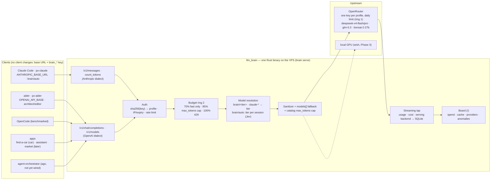

# llm_brain — Overview

The general document, deliberately short. Every point links to a page with
the full reasoning. Updated at every iteration: see the
[changelog](./changelog.md).

## What it is

**One LLM backend for every app and CLI.** A Rust reverse proxy on a
small VPS that speaks the two standard dialects (`/v1/messages`
Anthropic, `/v1/chat/completions` OpenAI), authenticates every client with
its own key, enforces a budget per profile and forwards to OpenRouter.
Clients change only a base URL and a key.

It exists to:

1. **Replace the Claude subscription** with a Claude Code workflow on
   cheap models, original target **< 40 €/month** → [Costs](./analysis/costs-90-10.md)
2. **Serve the apps** through the same layer: find-a-car and assistant
   first, then the second-hand market → [Apps](./architecture/apps.md)
3. **Keep the provider replaceable**: OpenRouter today, a local GPU some
   day, changing only config → [GPU](./architecture/gpu.md)

## Where we are

- **Phase 0 done** (2026-09-19 → 20): OpenRouter directly, per-profile keys
  with daily limits, first benchmark task, tiers chosen from data. → [Phase 0](./phase-0.md)
- **Phase 1 live** (since 2026-09-20): the proxy on the VPS, used every day
  by Claude Code (`px-claude`) and aider (`px-aider`), and by find-a-car.
  → [Phase 1 runbook](./phase-1.md) · [Configuration](./configuration.md) · [Deploy](./deploy-vps.md)
- **Since then**: `brain/auto` picks the tier once per session; the
  OpenRouter catalog caps `max_tokens` and prices custom models; each
  request records which backend served it; the board shows spend, prompt
  cache, providers and anomalies.
- **Next**: provider pinning to stop cross-backend cache misses,
  agent-orchestrator and assistant as clients, Litestream backups. → [Roadmap](./roadmap.md)

## The primary requirement: never blow the budget

- **Ring 1, OpenRouter**: prepaid credits and **one key per profile with a
  daily limit** (`limit_reset: daily`). A wall no bug can climb.
- **Ring 2, the proxy**: daily and monthly budget per profile with
  **degradation before the wall** — at 70 % only the `fast` tier, at 85 %
  a smaller `max_tokens`, at 100 % a `429` with a clear message.
- Budgets live in `config/profiles.yaml`: `dev` 5 $/day and 60 $/month
  soft, the apps 0.50 $/day. → [Budget](./architecture/budget.md)
- **Secrets: no client ever sees OpenRouter.** Upstream keys live only on
  the server; client keys `brain_<profile>_…` are stored hashed, one per
  app, issued only with `brain keys create` on the server. A compromised
  app spends at most its own budget. → [Secrets](./architecture/secrets.md) · [Auth flow](./architecture/auth-flow.md)
- **No refresh tokens**: it's machine-to-machine. Static per-app keys,
  overlapping rotation, an opaque `user` for per-user rate limits.
  → [Auth and topology](./architecture/auth-topology.md)

## The key ideas, one line each

- **Tiers, not models.** Clients ask for `brain/fast`, `brain/agent`,
  `brain/auto`…; concrete models are `config/tiers.yaml`. Today `fast` =
  deepseek-v4-flash, `medium` = glm-5.3-flash, `agent` = deepseek-v4-pro,
  `max` = glm-5.3, `reasoning` = bonsai-2-27b. → [Costs](./analysis/costs-90-10.md)
- **Route once per session, never per turn**: `brain/auto` asks a
  decision model (Jev, ~0.5 s, ~0 $) which rung of the ladder the task
  needs and keeps the loop there, so the prompt cache stays warm.
  → [Auto routing](./architecture/auto-routing.md)
- **Cost is driven by volume and cache, not price per token.** A coding
  agent re-sends a long prefix every turn: a turn that misses the prompt
  cache costs ~10× a warm one. Misses come from landing on a different
  backend. → [Cache](./architecture/cache.md)
- **A reverse proxy, not a translator**: OpenRouter already speaks both
  dialects. The proxy only authenticates, budgets, picks the model,
  sanitizes the fields non-Claude models reject, and records usage.
  → [API layer](./architecture/api-layer.md) · [Compatibility](./architecture/client-compatibility.md)
- **Claude Code's skills and hooks always work** behind the proxy: they
  are client-side. The risk is model quality. → [Claude Code and aider](./architecture/claude-code-aider.md)
- **Claude Code is the daily agent, aider the cheap editor**, OpenCode
  benchmarked as the open-source alternative. → [Which CLI](./analysis/cli.md)
- **Everything in Rust**: one static binary (axum, tokio, reqwest,
  rusqlite, clap), tens of MB of RAM. → [Stack](./analysis/stack.md)
- **Measure, then change**: a benchmark on real bugs from your repos
  (verifier = the tests pass) compares models and tools; nightly
  promotion is Phase 2. → [Benchmark](./architecture/benchmark.md)
- **A small VPS, apps anywhere**: performance is not a criterion (the
  model dominates), traffic is negligible. → [Hosting](./analysis/hosting-costs.md)

## How it's built

{/* diagram: 01-system-overview */}

All diagrams, with sources in `diagrams/`: → [Diagrams](./diagrams.md)

## Roadmap in brief

| Phase | What | Status |
|-------|------|--------|
| 0 | OpenRouter directly, one key per profile, first benchmark | done |
| 1 | Key-authenticated reverse proxy with budgets, `brain/auto`, board | live |
| 2 | Nightly benchmark with promotion, escalation on failure, L2 cache | not started |
| 3 *(wish)* | `fast` tier on a local GPU | not planned |

→ [Roadmap](./roadmap.md) · [Decisions](./decisions.md)

## Sources and reference repos

- [agent-orchestrator](https://github.com/pjcau/agent-orchestrator) — becomes a client of llm_brain
- [claude-kit](https://github.com/pjcau/claude-kit) — portable hooks/skills/agents, the `.claude-kit/` submodule
- Alternative gateways and CLIs → [Tool landscape](./analysis/tool-landscape.md)
